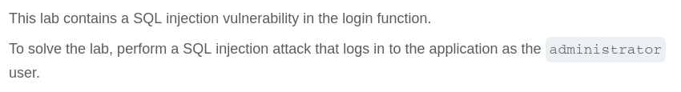
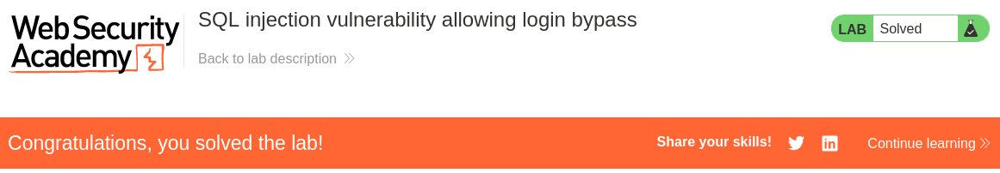

# Write-up: SQL injection vulnerability allowing login bypass

Lab-Link: <https://portswigger.net/web-security/sql-injection/lab-login-bypass>  
Difficulty: APPRENTICE  
  

## Lab description



## Steps

### Enumeration

I checked out how the login works using interceptor and found out that the request is like
`&username=user&password=user`

### Exploit

To login as administrator without knowing the password, we need to make sure the request is always true. I used `username=administrator'+OR+1=1--` to login as administrator.

The result query should look like
```sql
SELECT * FROM users WHERE username = 'administrator' OR 1=1-- AND password = 'pass'
```

This login me as user administrator and after changing the email to anything solves the lab.

