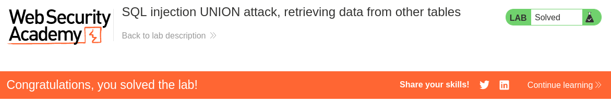

# Write-up: SQL injection UNION attack, retrieving data from other tables
Lab-Link: <https://portswigger.net/web-security/sql-injection/union-attacks/lab-retrieve-data-from-other-tables>  
Difficulty: PRACTITIONER  
 

## Lab description


## Steps

### Enumeration

To find the number of columns returned by the query, we can use the `UNION` method. We will start with `UNION SELECT NULL` and increase the number until we get an error. This will give us the number of columns returned by the query. Using this we doesn't get error at `UNION SELECT NULL, NULL`, which means the number of columns is 2.

The link is `/filter?category=Gifts'+UNION+SELECT+NULL,NULL--`

sqli payload is
```sql
' UNION SELECT NULL, NULL--
```

### Solution

Now, we need to find the credentials of the administrator. We can use the `users` table in the database. The column `username` and `password` contains the user credentials. We can use the following link to list the table values. 
`/filter?category=Gifts'+UNION+SELECT+username,password+FROM+users--`

This gives the username and password for `administrator` of the user. And we can login as administrator.

Hence, the lab is sovled.

