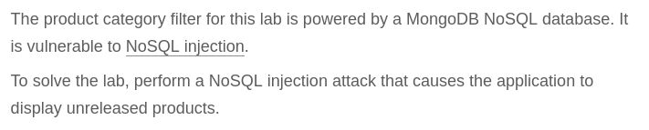
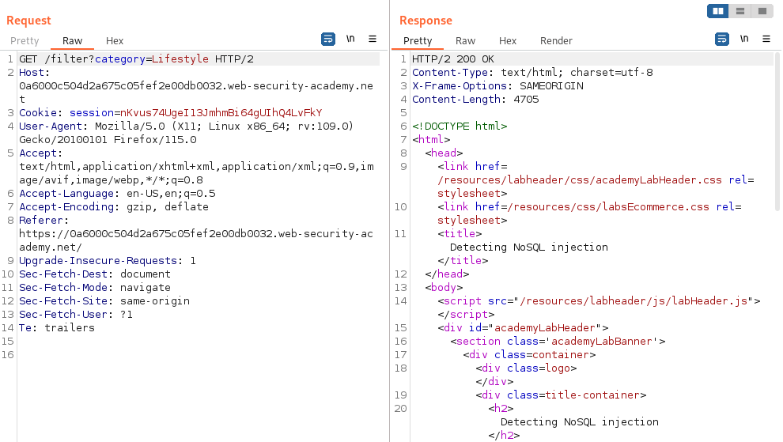
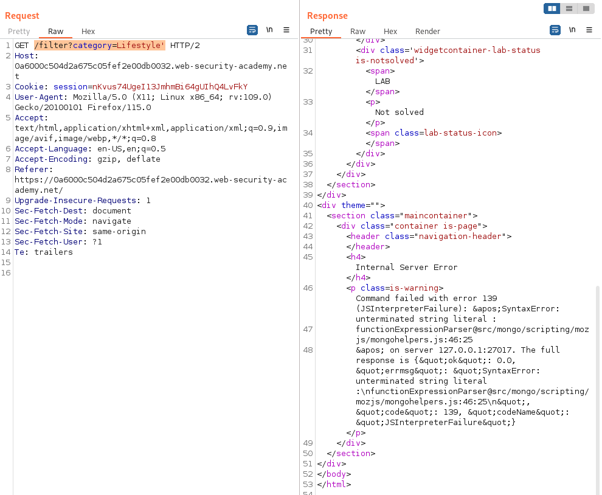

# Write-up: Detecting NoSQL injection

Lab-Link: <https://portswigger.net/web-security/nosql-injection/lab-nosql-injection-detection>  
Difficulty: APPRENTICE  
  

## Lab description

## Steps

As per the description, the application is using MongoDB NoSQL database and the product filtering is vulnerable to NoSQL injection and we need to exploit it to fetch unreleased products. Lets capture the product filtering request using burpsuite proxy.

### POC

We can manipulate the category parameter by adding single quote `/filter?category=Lifestyle'`. This gives error in response showing that NoSQL vulnerability might exist.

### Exploitation

For showcasing all products, we need to manipulating the current NoSQL query. For this, we will be using OR operator `||` which will make the filter request always true and will fetch all products including unreleased `/filter?category=Lifestyle'||1||'`

Hence, lab is solved.

