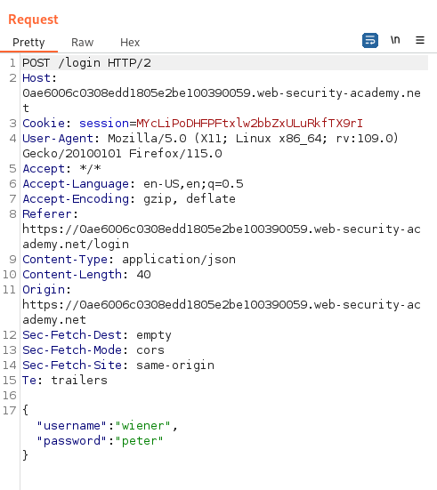

# Write-up: Exploiting NoSQL operator injection to bypass authentication

Lab-Link: <https://portswigger.net/web-security/nosql-injection/lab-nosql-injection-bypass-authentication>  
Difficulty: APPRENTICE  
  

## Lab description

## Steps

As per the description, the application is using MongoDB NoSQL database and it is vulnerable to NoSQL injection. Our task is to bypass authentcation and login as an `administrator` user.

Lets login with given user creds `wiener:peter` and capture that request.

### POC

If we append `"$ne": ""` in username we still get logged in proving that we can do NoSQL operator injection.

### Exploitation

For our task of logging as admin user. We don't know the admin username, but it will most probably have admin in it. So, first we need to check if we can use `$regex` operator. For that, if we will use `"$regex": "wie.*"` in username we get logged in. 

Now, lets exploit for `admin` user using payload `"$regex": ".*admin.*"` and since we don't know the password lets keep it as `"$ne":""`. And we can get logged in as user `adminvk1luv4z`.

Now, we need to login as `adminvk1luv4z` in browser. So, for this we will login as `wiener:peter` and capture this request in burpsuite and change the username,password json with `{"username":{"$regex": ".*admin.*"},"password":{"$ne": ""}}`

And we get logged in as an admin user `adminvk1luv4z`.
Hence, lab is solved.

