# Write-up: Exploiting NoSQL injection to extract data

Lab-Link: <https://portswigger.net/web-security/nosql-injection/lab-nosql-injection-extract-data>  
Difficulty: PRACTITIONER  
  

## Lab description

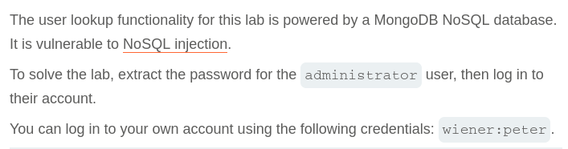

## Steps

As per the description, the application is using MongoDB NoSQL database and it is vulnerable to NoSQL injection. Our goal is to find the password for the `administrator` user.

Lets login with given user creds `wiener:peter` and capture the request where user details is being fetched.

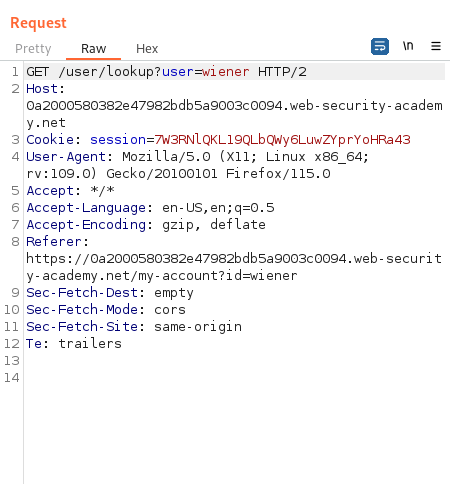

### POC

If we append single quote `/user/lookup?user=wiener'` in username we get error in getting user details.\
**Note:** All urls are encode before sending the request.

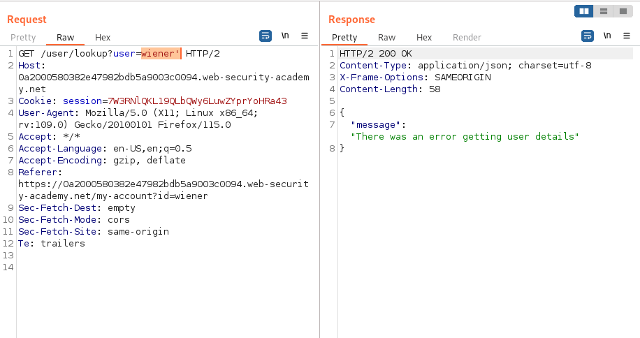

But we try operator injection and append `'+'` in url we get success response with `wiener` user details. Now, instead of wiener if we fetch `administrator` details we get success response.

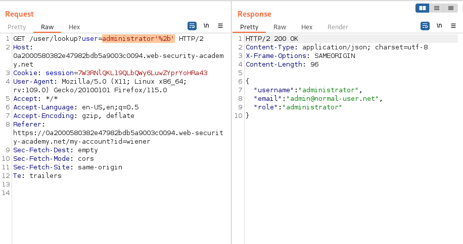

### Exploitation

To extract the administrator password, we first need to find the length of the password. Using payload `administrator'&&this.password.length==1&&'a'=='a`. This payload compares the length of the password with every number. We now automates this to get a successful response using `Intruder`.
Attack Type will be Sniper, Payload Set is Number from 0 to 30 with step as 1. This gives us a response where with number 8 we get response with user details.

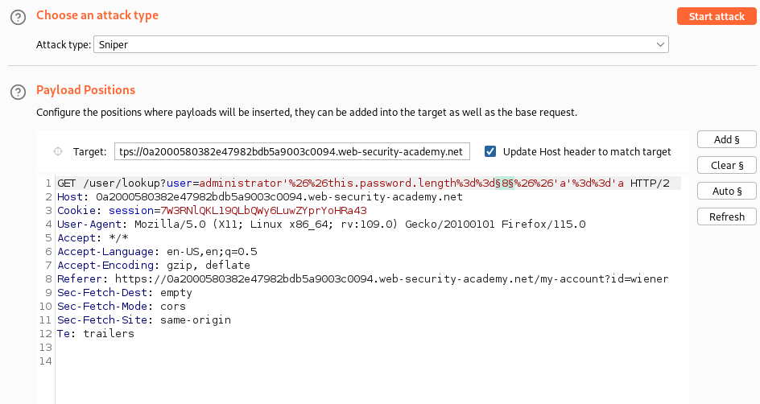
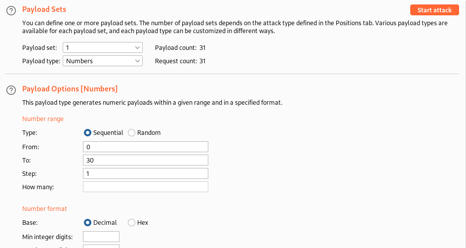
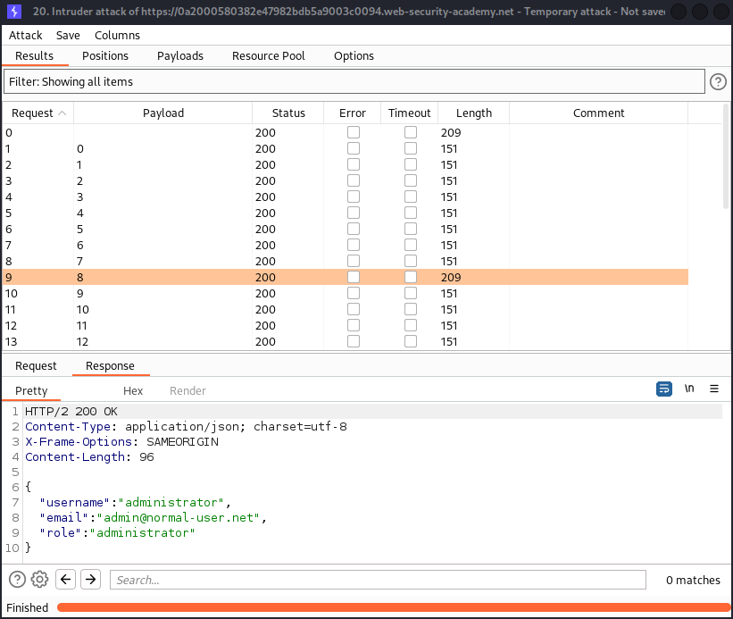

Now, we have the password length as `8`. Similarly, we can start comparing each password character with every possible character `a-z,0-9,A-Z` and if it matches we get user details.

Payload will be `administrator'&&this.password[0]=='a'&&'a'=='a`. Attack type will be `Cluster bomb` because we are 2 different payloads and both will be have different payload set.

For character position, we will be using numbers from 0 to 7 summing up to total 8 characters. For characters to compare we will be using sets from `a-z,A-Z,0-9`.

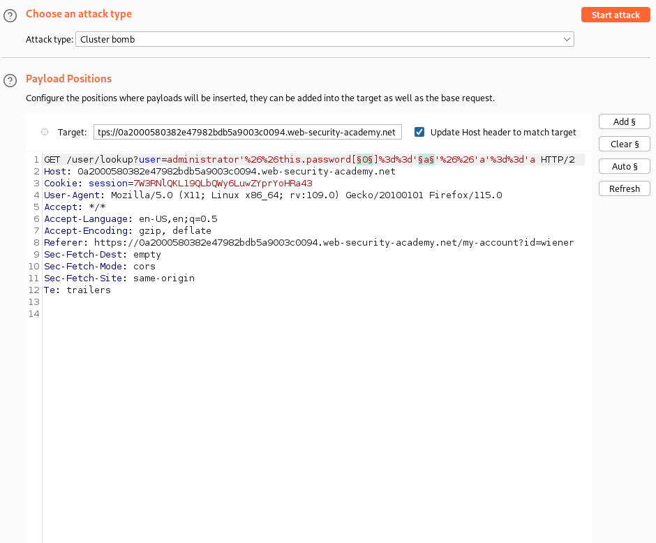
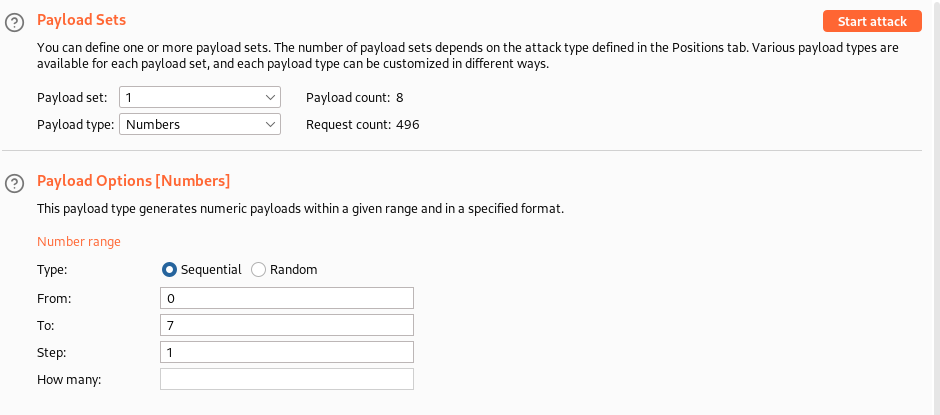
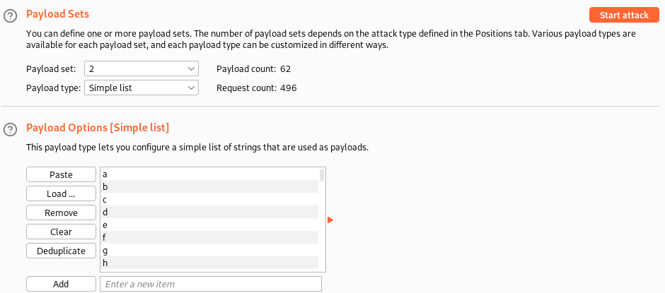
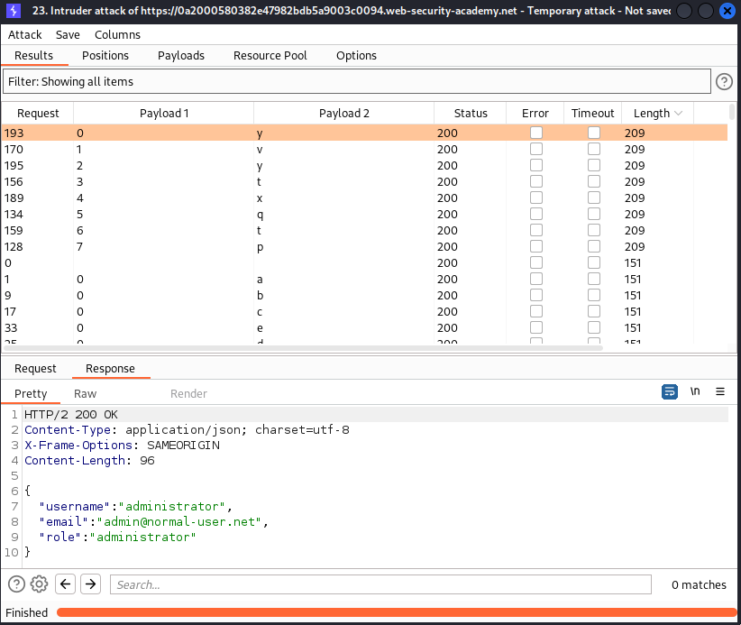

And we get logged in as an `administrator` and password `yvytxqtp`.

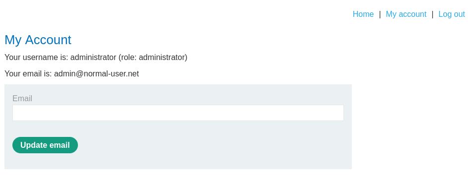

Hence, lab is solved.

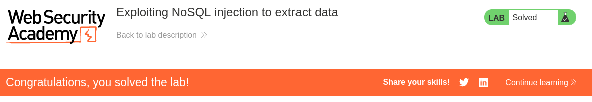

