# Write-up: 4. Exploiting NoSQl operator injection to extract unknown fields

Lab-Link: <https://portswigger.net/web-security/nosql-injection/lab-nosql-injection-extract-unknown-fields>  
Difficulty: PRACTITIONER  
  

## Lab description

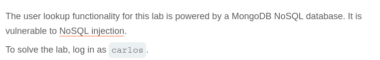

## Steps

As per the description, the application is using MongoDB NoSQL database and it is vulnerable to NoSQL injection. Our goal is to login as `carlos` user.

If we try and login with credentials `carlos:carlos` we get Invalid as response. After capturing this request with burpsuite and sending to repeater, lets change the json to `{"username":"carlos","password":{"$ne":""}}` after this we get response that `Account Locked: please reset your password`. But this means that application is accepting `$ne`, so it is vulnerable to operator injection.

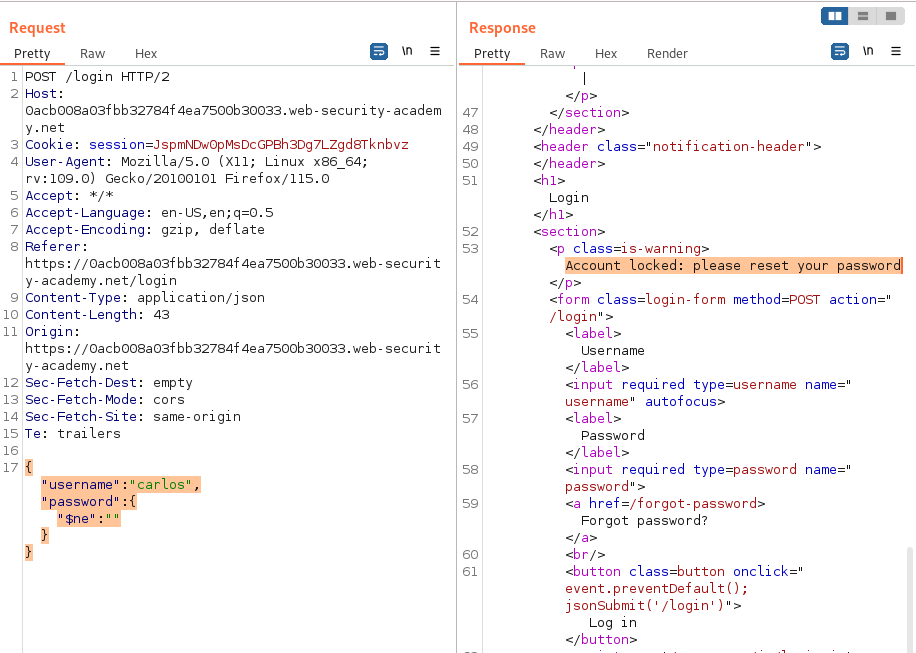

Lets try and reset the password of `carlos` user using Forgot Password user. This request sends a reset password link to email.

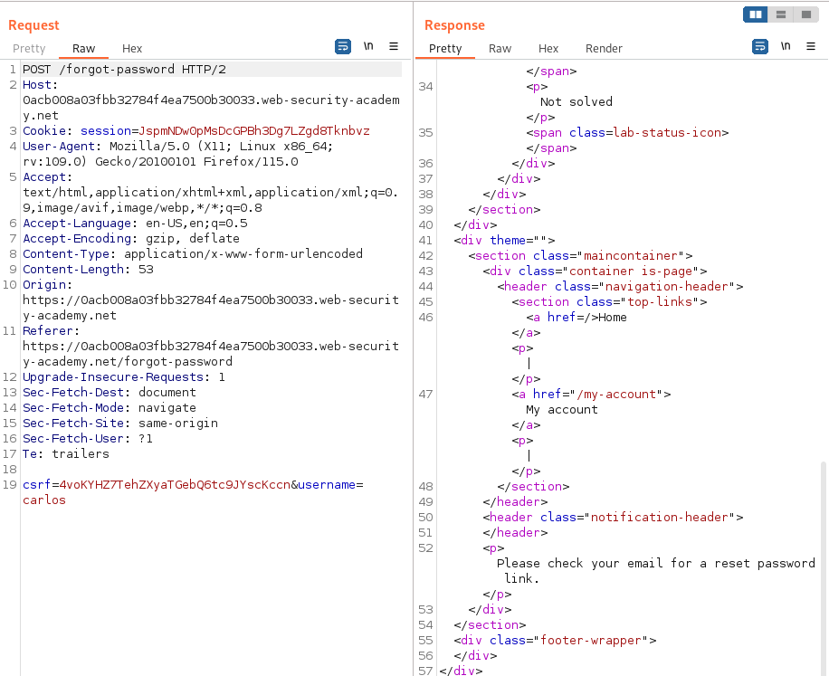

Now in login request only, injecting other operators for extracting data. If we append `$where` operator as additional parameter 2 different times, once when the request is false and once when request is true we get different responses stating that we can extract information using `$where`.

First payload is `{"username":"carlos","password":{"$ne":""}, "$where":"0" }`, we get `Invalid username or password`.
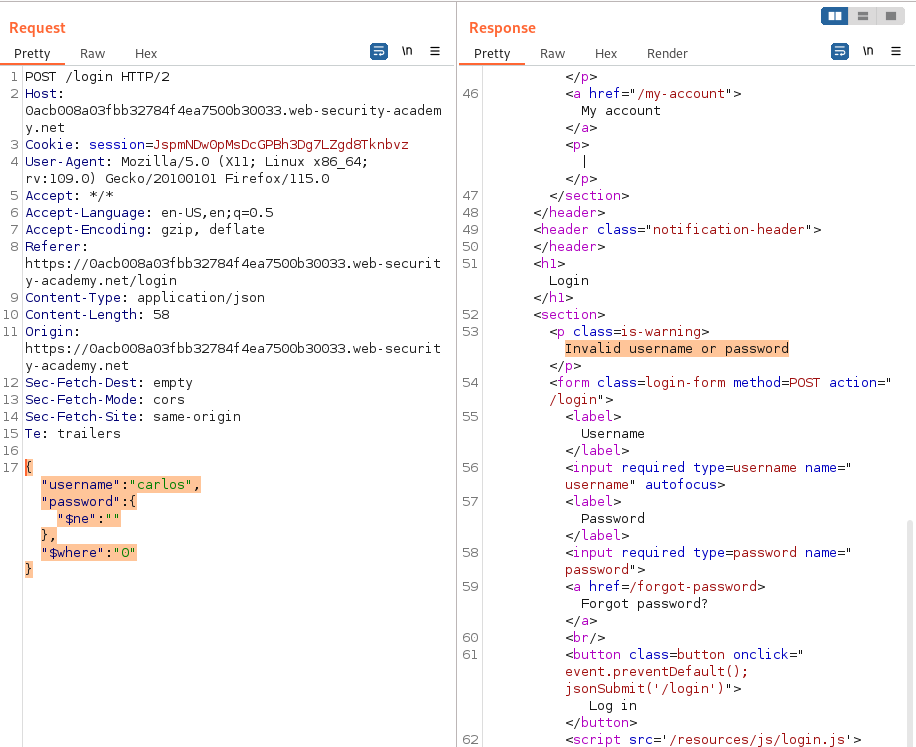
Second payload is `{"username":"carlos","password":{"$ne":""}, "$where":"1" }` we get `Account locked: reset your password`.
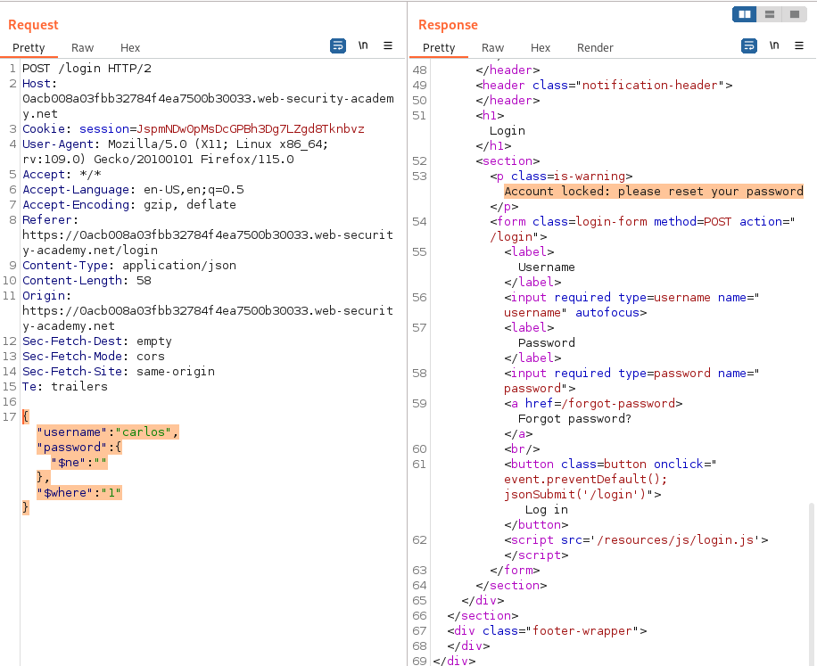

Since, we can use `$where` lets use it to find the key name for the token for `carlos` user for resetting the password.
Lets use intruder with payload `{"username":"carlos","password":{"$ne":""}, "$where":"Object.keys(this)[§1§].match('^.{§§}§§.*'" }`. We have 3 payload position, first one for key poition, second for the character position of a key, third for comparing the character at a position.
We will be using `Cluster bomb` attack type, Payload set for position 1 and 2 will be Number with range from 0-5 and 0-20 respectively and for position 3 we use simple list with sets of `a-z,A-Z,0-9`.
Also, we will grep `Account locked`, because when request works and condition is true we get Account locked as response.

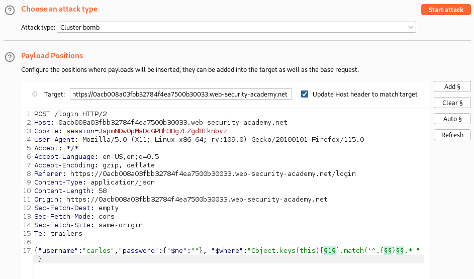
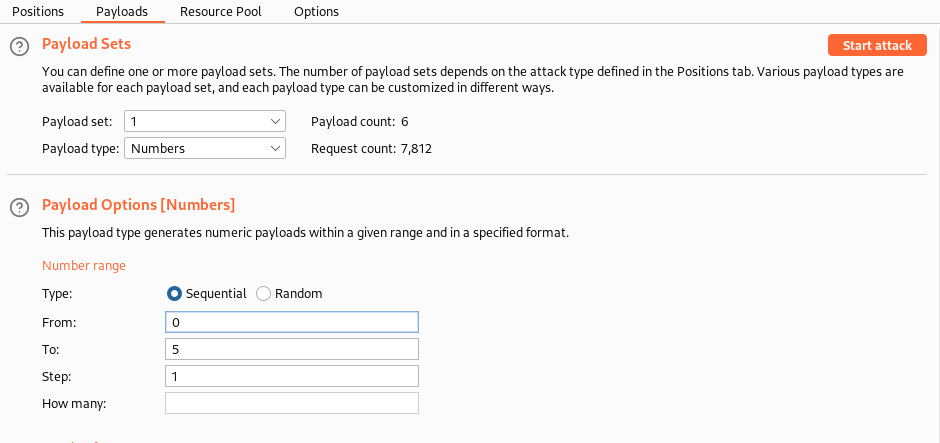
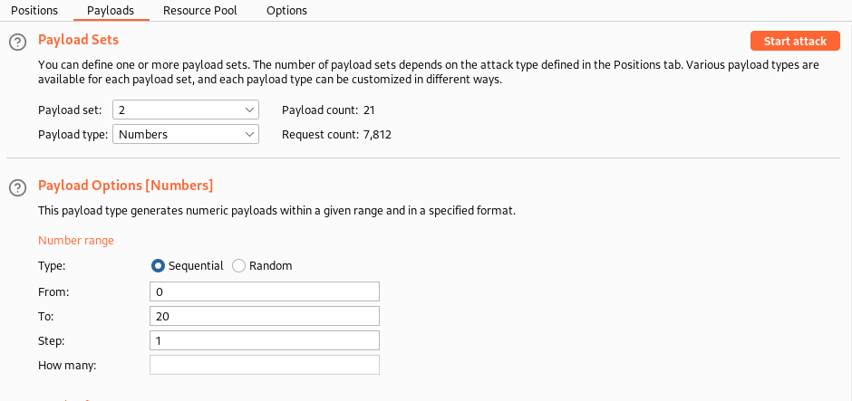
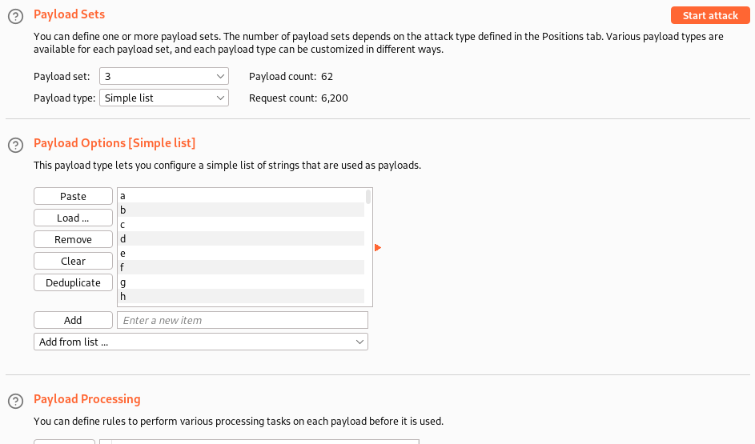
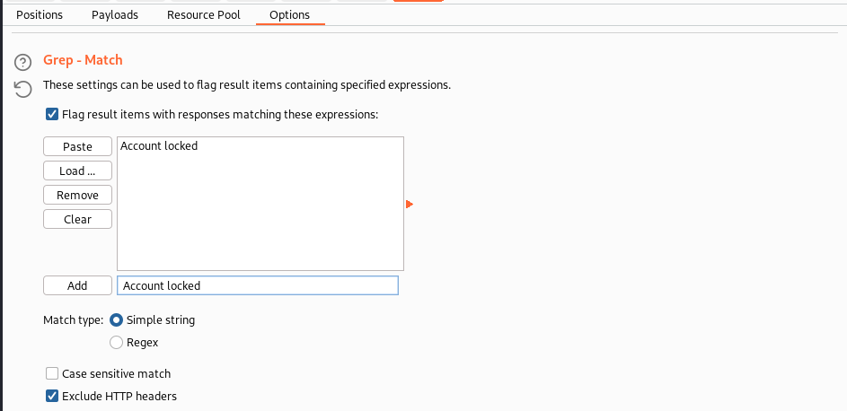
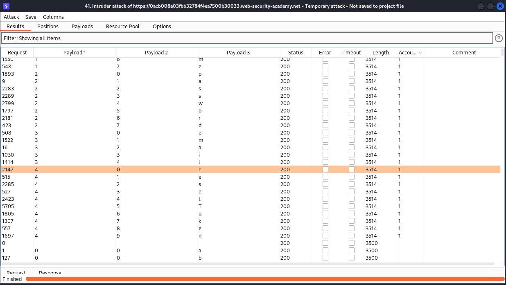

After this we can retrieve that there are 5 keys with name 'id','username','password','email','resetToken'.

Now, we have the key name as `resetToken`, we can confirm this by sending request `/forget-password?resetToken=invalid` which resends response and also change POST request to GET, we get "Invalid token" which shows that request is valid.

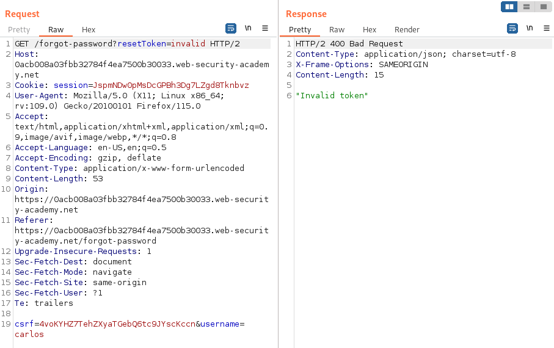

Now, to fetch the resetToken value we use intruder with payload `{"username":"carlos","password":{"$ne":""},"$where":"this.resetToken.match('^.{§§}§§.*')"}`. With Cluster bomb attack type and 2 payload position.
First payload set with Numbers  from 0 to 20 and Second payload set with simple list of `a-z,A-Z,0-9`. And also use grep(match) of `Account locked`.

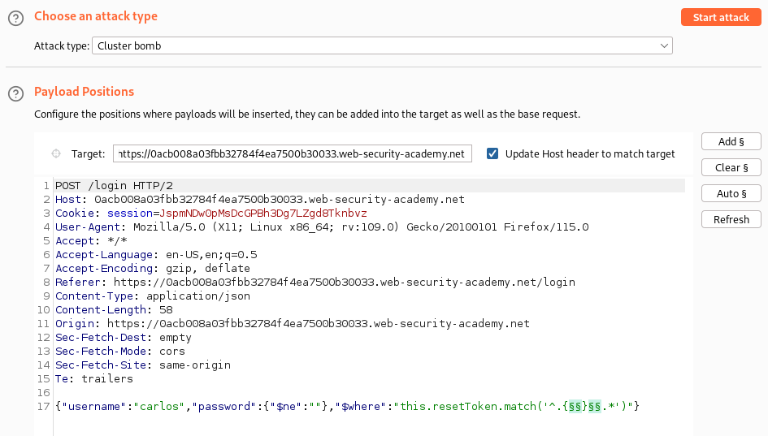
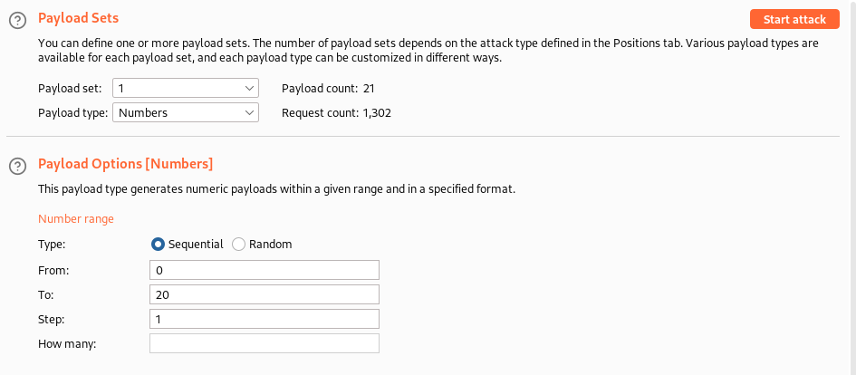
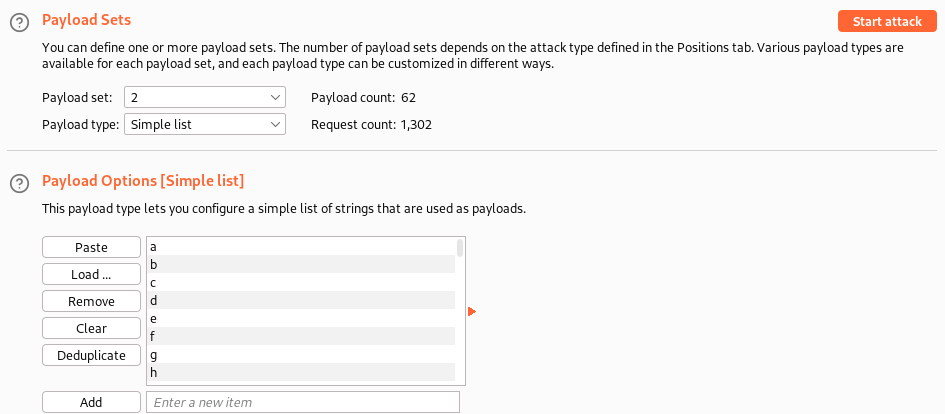
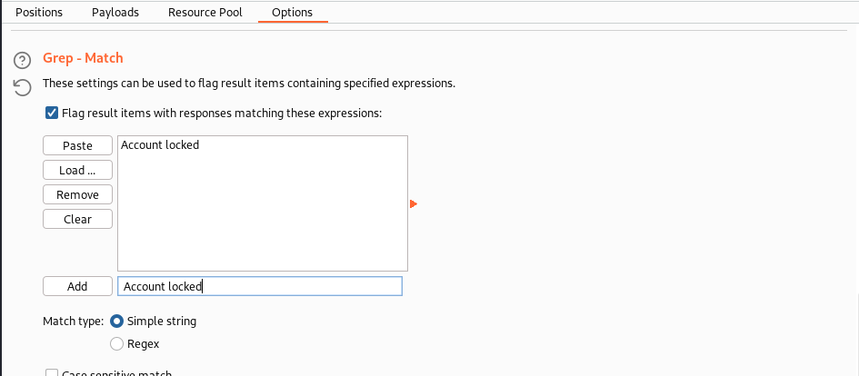

Now, after this attack we get resetToken for `carlos` as `048fb3dcf6b6d203`.

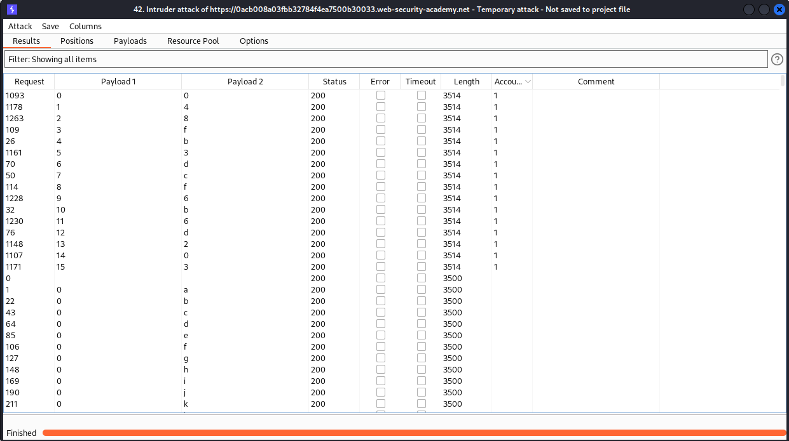

Lets send the GET request again with the resetToken  `/forget-password?resetToken=048fb3dcf6b6d203` we get success response. Now, we can open this request in browser using the burp option.

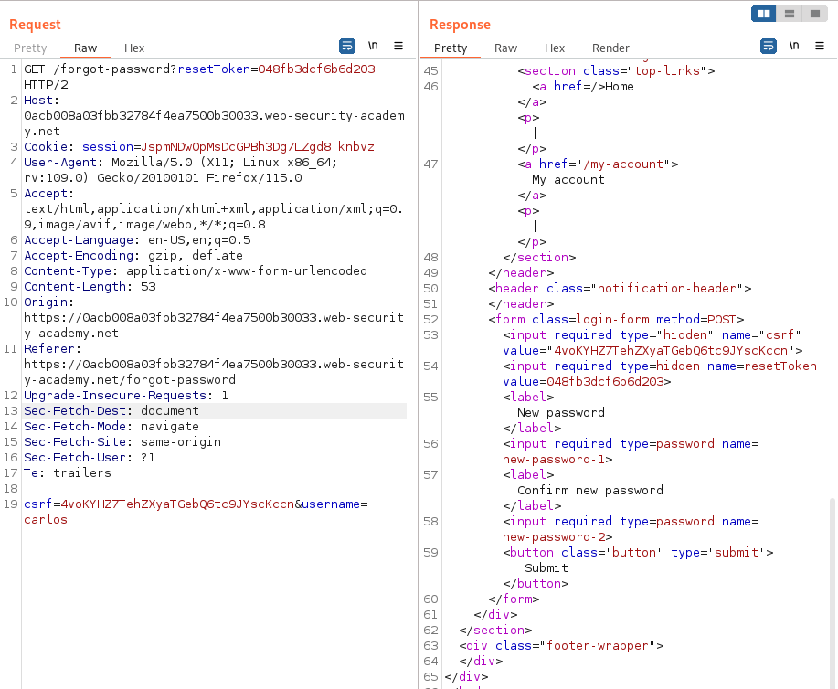
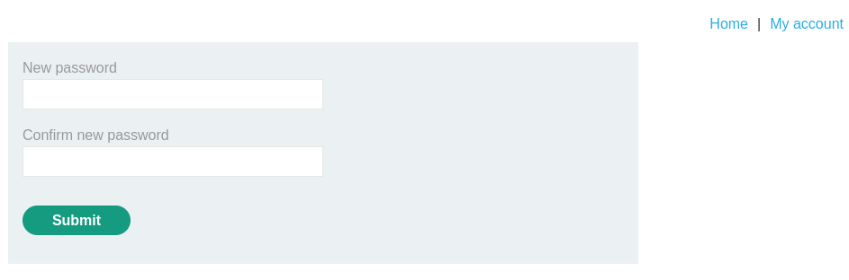

Set new password and logged in with that and hence lab is solved.

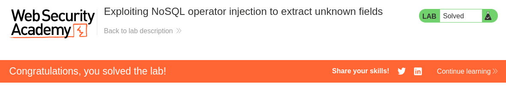