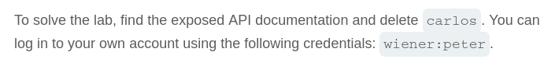
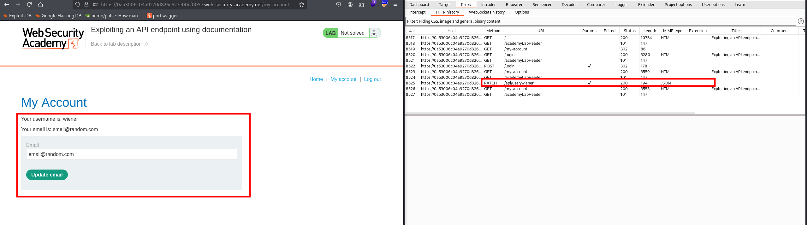
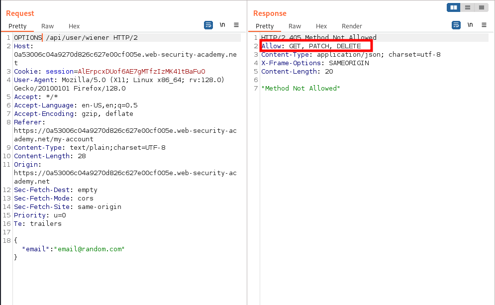
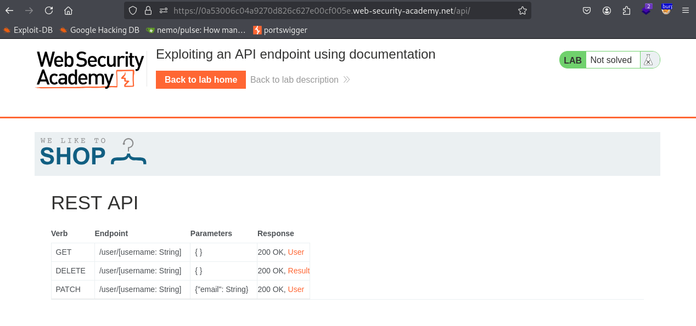
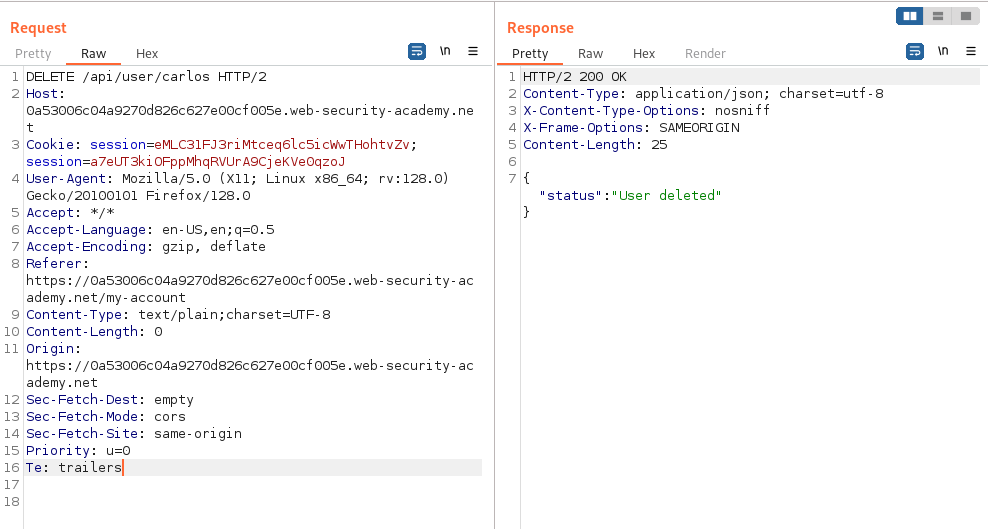
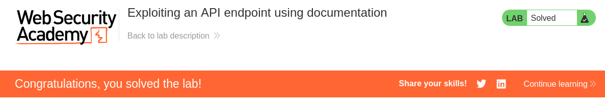

# Write-up: Exploiting an API endpoint using documentation

Lab-Link: <https://portswigger.net/web-security/api-testing/lab-exploiting-api-endpoint-using-documentation>  
Difficulty: APPRENTICE  
  

## Lab description

### Goals

- Find exposed API documentation
- Delete `carlos` user

## Steps

Start Burp proxy, login into the website using given credentials `wiener:peter`. After login, we get option to change email, we change email we can that a `PATCH` packet is captured `/api/user/wiener`.

When `PATCH` is changed with `OPTIONS` we get response that `GET, PATCH, DELETE` are allowed. So, we can probably delete the `carlos` user using this but our goal is also to find the API documentation.  

We can find the API documentation at `/api` when `/user/wiener` is removed.

Using the found `DELETE` API request we can now delete the user `/carlos`.

Hence, lab is solved.

