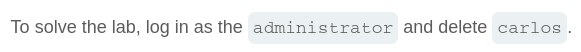
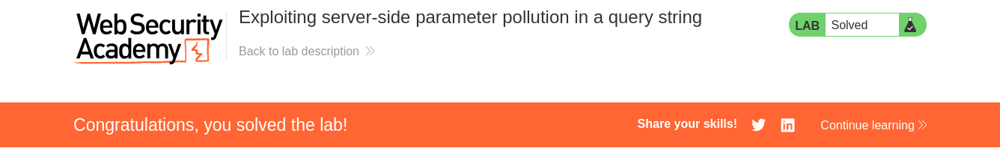

# Write-up: Exploiting server-side parameter pollution in a query string

Lab-Link: <https://portswigger.net/web-security/api-testing/server-side-parameter-pollution/lab-exploiting-server-side-parameter-pollution-in-query-string>  
Difficulty: PRACTITIONER  
  

## Lab description

### Goals

- Login as the `administrator`
- Delete user `carlos`

## Steps

While going through the website we can see the forgot password page. When we enter `administrator` we get response that email has been sent to the user's email address. 

In the burp proxy history, we find a static js file `/static/js/forgotPassword.js` and inside this we can see a request `/forgot-password?reset_token=${resetToken}`. Now, we need to exfiltrate the reset token for `administrator`

We also captured the `POST` request for `forgot-password` in proxy history.

If we change the username parameter, we get invalid username as response.

And now, we append `&param=random` basically a random paramater with encoded `&` we get response that the parameter `param` is not supported. Which means that our paramater is being checked by the application.

Removing above if we append encoded `#` which comments out the later, we get response that `field` is not specified. Meaning that a field value is used by the application.

Now, we if we change the username paramter value to `administrator&field=random#` with encoded key characters. Since, i don't know the field value i put in random. We get response that the invalid field is put in which was kinda expected.

But, earlier in the static js file we found out that `reset_token` variable if used, we use that as field value we get the successful response with reset_token value for administrator user.

When, we use the js file user and the reset_token with it and go to url `/forgot-password/?reset_token=value` we can change the administrator password. And then use that to login as `administrator`.

Now, we delete the user `carlos`.

Hence, lab is solved achieving both of our goals.

