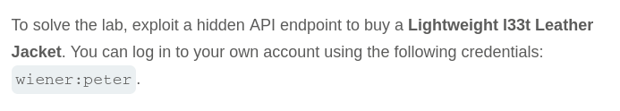
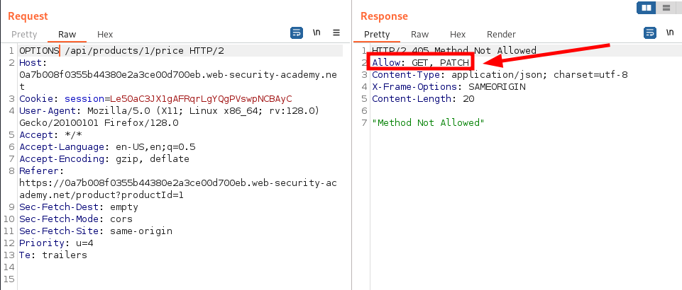
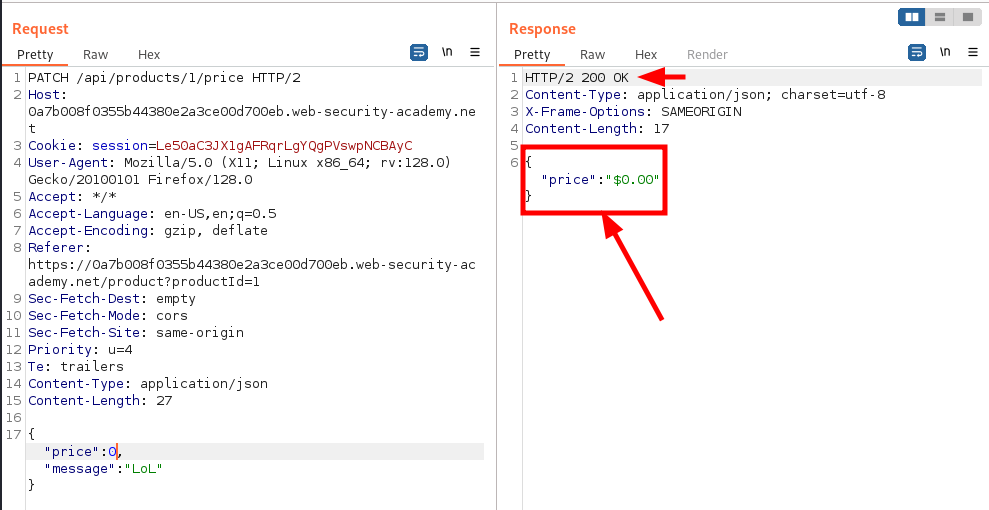

# Write-up: Finding and exploiting an unused API endpoint

Lab-Link: <https://portswigger.net/web-security/api-testing/lab-exploiting-unused-api-endpoint>  
Difficulty: PRACTITIONER  
  

## Lab description

### Goals

- Exploit hidden API Endpoint
    - Buy a `Lighweight l33t Leather Jacket` using this hidden API endpoint

## Steps

Start Burp Proxy and make sure every request is going through burp proxy and is visible in http history. login into the website using given credentials `wiener:peter`. After login we can see that we have `$0.00` store credits.

We can find the product `Lighweight l33t Leather Jacket` whose value is `$1337.00`. After this adding product to cart, if we try to buy this product we get response that we don't have enough store credits.

Now, to buy this product we have to either manipulate our store credits or the product cost or the third option is to bypass the order value checker while placing the order.

If we check the http history in burp proxy we come across the API `/api/products/1/price`.

After sending this request to repeater, instead of sending `GET` if we use `OPTIONS` we can see that `PATCH` method is also allowed.

When we send PATCH request, we get error that only `application/json`, which makes sense because we need to send some json value which have to change and also have to add header `Content-Type: application/json`.

But we get error that price value must be integer, so we just change the value from string to integer `0` and successful response.

Now, we can very from the product page and just add it to cart and buy the product.

Hence, lab is solved after clicking on `Place Order` button.

