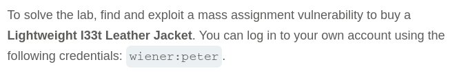
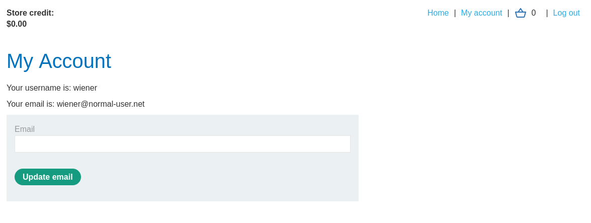
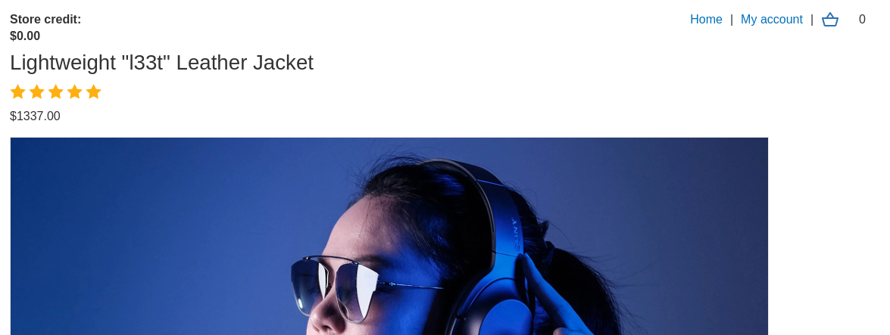
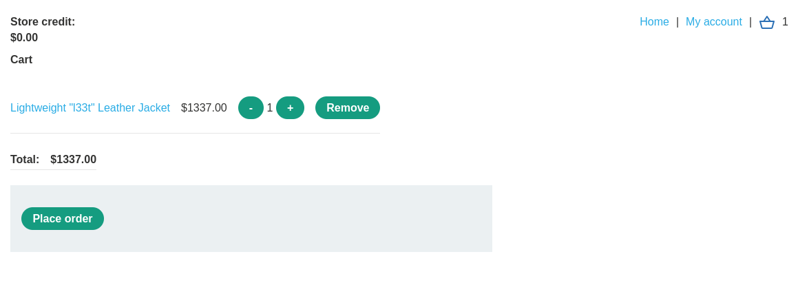
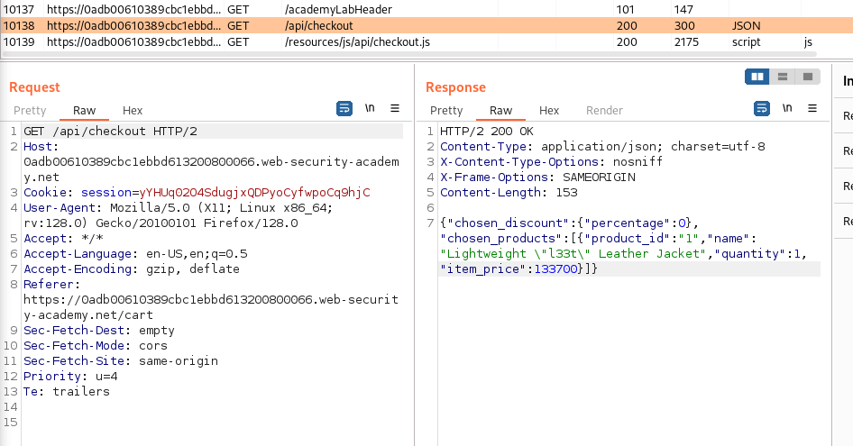
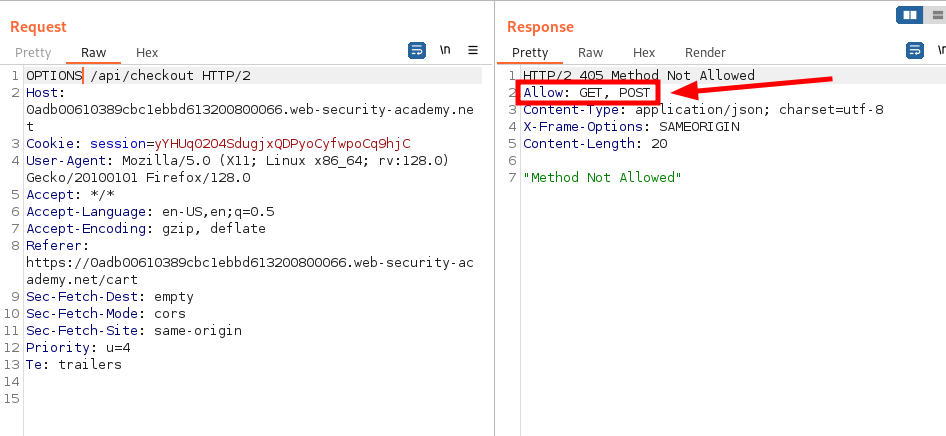
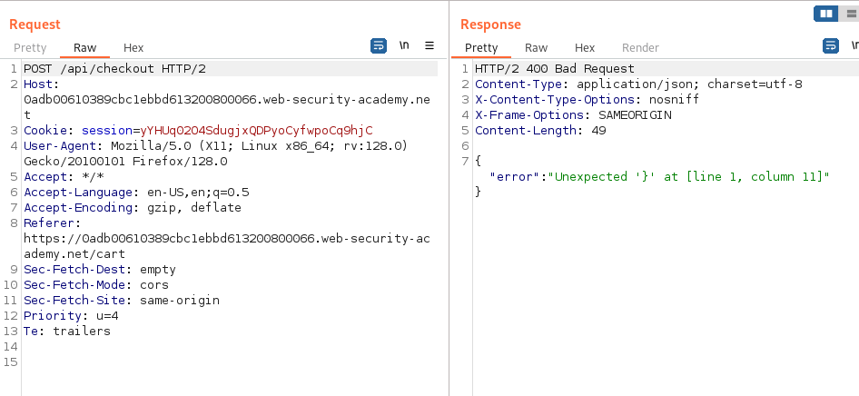
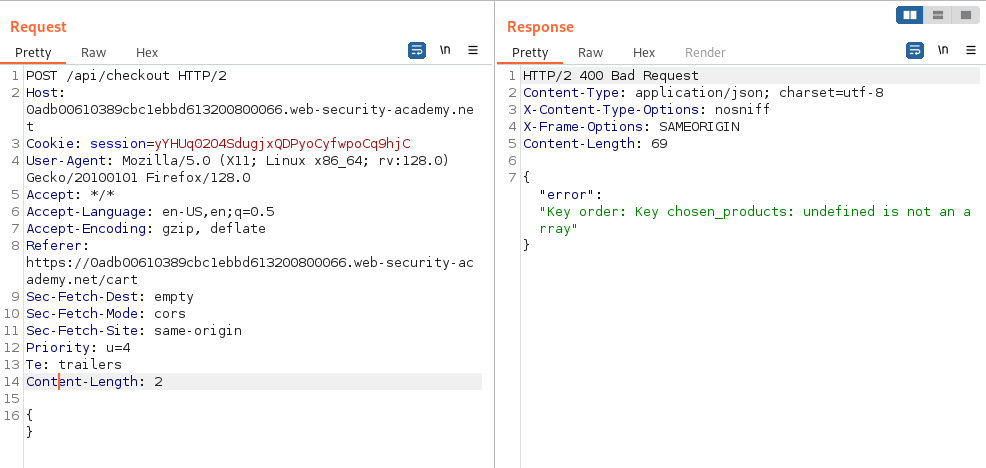
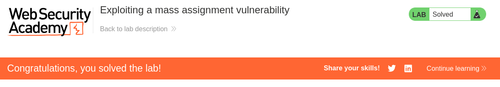

# Write-up: Exploiting a mass assignment

Lab-Link: <https://portswigger.net/web-security/api-testing/lab-exploiting-mass-assignment-vulnerability>  
Difficulty: PRACTITIONER  
  

## Lab description

### Goals

- Find mass assignment vulnerability
- Exploit this mass assignment vulnerability
- Buy this product `Lightweight l33t Leather Jacket` using this vulnerability

## Steps

Start Burp Proxy and make sure every request is going through burp proxy and is visible in http history. login into the website using given credentials `wiener:peter`. After login we can see that we have `$0.00` store credits.

When we visit `Lightweight l33t Leather Jacket` we find that it worth `$1337.00` and we add it to card, and when we try to buy this product we get error that we don't have enough store credits.

Now, to buy this product we have to either manipulate our store credits or the product cost or the third option is to bypass the order value checker while placing the order.

When checking the http history in burp proxy we come across an interesting API `/api/checkout` which has a JSON response with some lucrative keywords like `chosen_discount` and `item price`, so we send it to repeater for futher analysis.

When we send `OPTIONS` request instead of `GET` we get to know that `POST` API is also available for the same.

When sending POST request, we get error `Unexpected }`, which hints towards that we have to add some JSON data with the request.

When we add an empty JSON, we get error that `chosen_products` is undefined.

So, I just copied the JSON reponse of the `GET` request and changed the discount percentage to `100` so that we can buy the product with `$0.00` store credits. We get response and get redirected to order-confirmation.

Hence, lab is solved.

