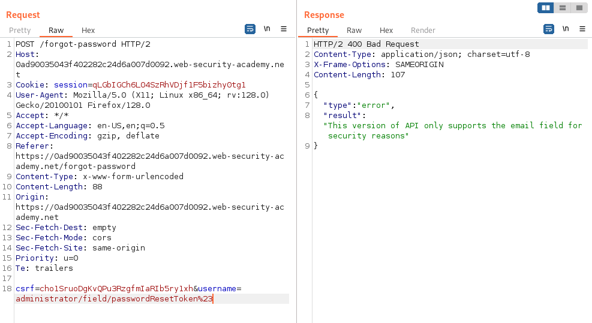

# Write-up: Exploiting server-side parameter pollution in a REST URL

Lab-Link: <https://portswigger.net/web-security/api-testing/server-side-parameter-pollution/lab-exploiting-server-side-parameter-pollution-in-rest-url>  
Difficulty: EXPERT

## Lab description

### Goals

- Login as the `administrator`
- Delete the user `carlos`

## Steps

Start Burp Proxy and make sure every request is going through burp proxy and is visible in http history. Manually crawl through the website and look for interesting request in the http history. When we fill forgot password form we get `/static/js/forgotPassword.js` in which can see that in the email we get some password reset token using which can reset the password. So, we have to target this reset token.

If we append encode character `#` to the username we get error `invalid route` which shows this username is internally used in a url.

We can again verify this using `?` which is used in URLs to add parameters to the url.

If we change the username to `./administrator` we get the actual response.

And we change the username to `../administrator` we get error `invalid route`.

Basically we are attempting to traverse the url in hope of finding something. And we get an internal Error on `../../../../administrator`. So we have reached some root of the API.

We find an interesting API `/api/internal/v1/users/{username}/field/{field}` in `openapi.json` at `../../../../openapi.json#`. `Openapi.json` file contains api documentation of an API. Popular Swagger for API documentation was formerly called OpenAPI.

Since, we are already at the `/{usename}` we will change the username value to `/administrator/field/passwordResetToken%23`. We are targeting the passwordResetToken. But we get the error that the API only supports the email field for security reasons.

The current API could be the lastest so we will target the older version `v1` and change the username value to `../../v1/users/administrator/field/passwordResetToken%23` and we get the reset token in the response.

Now, we just visit the url which we found in the `forgot-password.js` `/forgot-password?passwordResetToken={value}`. Here we can just change the password of the `administrator`. 

Easy part is left now, to just login as `administrator` and delete the user `carlos`.

Hence, lab is solved.

