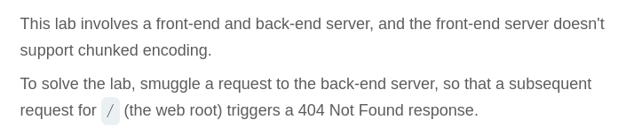

# Write-up: HTTP request smuggling, confirming a CL.TE vulnerability via differential responses

Lab-Link: <https://portswigger.net/web-security/request-smuggling/finding/lab-confirming-cl-te-via-differential-responses>  
Difficulty: PRACTITIONER  
  

## Lab description



### Goals

- Smuggle a request to the back-end server, so that a subsequent request for `/` (the web root) triggers a 404 Not Found response.

## Steps

We know that the front-end server doesn't support chunked encoding. So, we will manipulate the request using repeater and add few things in it.

- Add `Transfer-Encoding: chunked`
- Body should be 0
- And append another `GET` request in body.
```
0

GET /404 HTTP/1.1
X-Ignore: x
```


Also the `Content-Length` becomes `35`.
Make sure the request is sent as `HTTP/1.1`.

When we send this request first time we get proper response, but on sending this request again we get `404 Not Found`.


Hence, we are able to solve the lab.


### Analysis

CL.TE vulnerability basically occurs when a discrepency between how a frontend and a backend server interpret "Content-Length" and "Transfer-Encoding" headers leading to HTTP request smuggling.
Whereas the differential responses attack 
