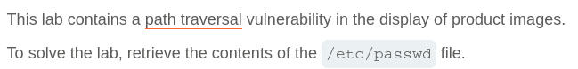
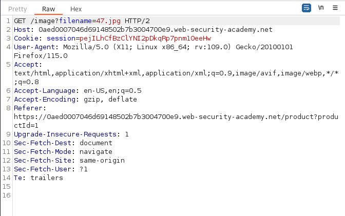
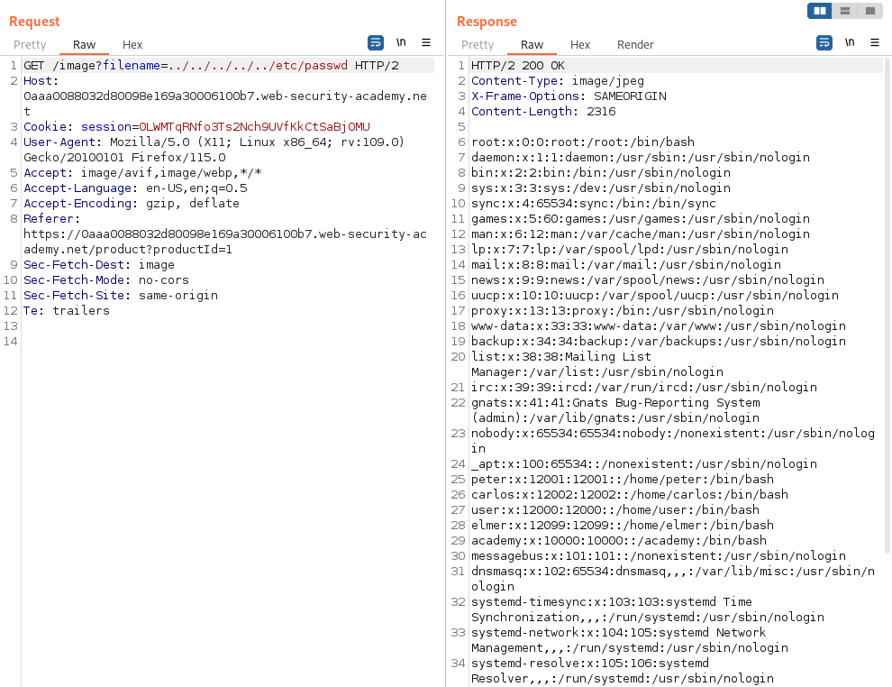

# Write-up: File path traversal, simple case

Lab-Link: <https://portswigger.net/web-security/file-path-traversal/lab-simple>  
Difficulty: APPRENTICE  
  

## Lab description

## Steps

As per the description, the vulnerability lies in the product image. On intercepting the product image request using burpsuite, we can see that the request url is `/image?filename=47.jpg` here the filename parameter is used.

On manupulating the request parameter using Burpsuite Repeater `/image?filename=/etc/passwd` it responds with status 400 "No such file". But if we use double dots for minimum 3 times for filepath, since the application can only accept relative path `/image?filename=../../../etc/passwd`

Therefore, we are able to fetch the details

