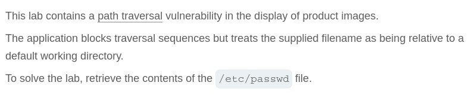
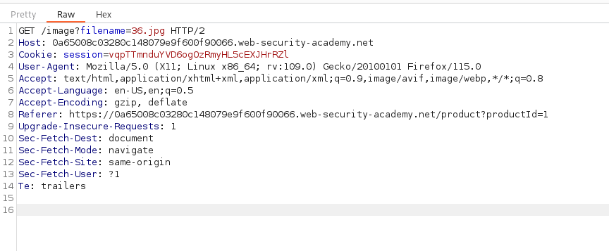
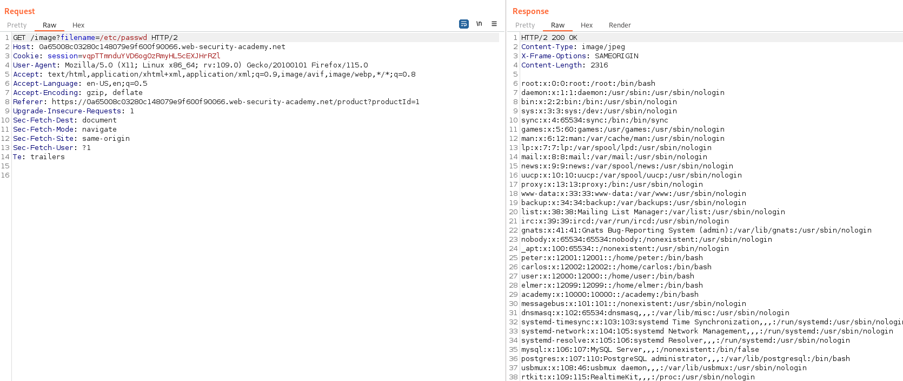

# Write-up: File path traversal, traversal sequences blocked with absolute path bypass

Lab-Link: <https://portswigger.net/web-security/file-path-traversal/lab-absolute-path-bypass>  
Difficulty: PRACTITIONER  
  

## Lab description

## Steps

As per the description, the vulnerability lies in the product image. On intercepting the product image request using burpsuite, we can see that the request url is `/image?filename=36.jpg` here the filename parameter is used for specifiying the filename and possibly the path also.

On manupulating the request parameter using Burpsuite Repeater `/image?filename=/etc/passwd` it responds with status 200. Also in the lab description it was mentioned that relative path is blocked by the application but absolute path is working.

Therefore, we are able to fetch the file `/etc/passwd`

