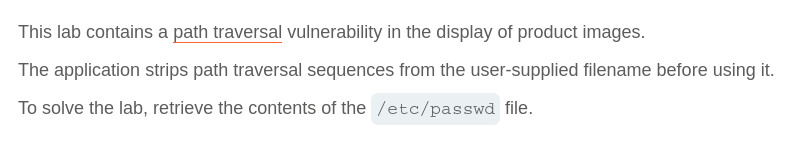
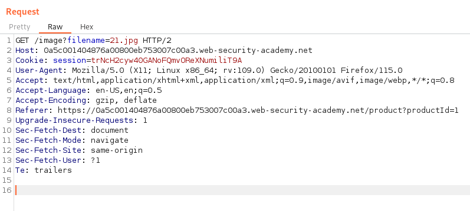
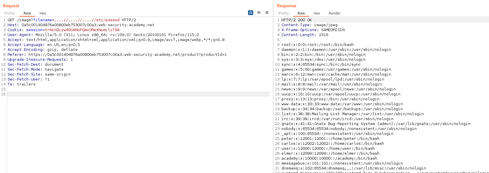

# Write-up: File path traversal, traversal sequences stripped non-recursively

Lab-Link: <https://portswigger.net/web-security/file-path-traversal/lab-sequences-stripped-non-recursively>  
Difficulty: PRACTITIONER  
  

## Lab description

## Steps

As per the description, the vulnerability lies in the product image. On intercepting the product image request using burpsuite, we can see that the request url is `/image?filename=21.jpg` here the filename parameter is used for specifiying the filename and possibly the path also.

On manupulating the request parameter using Burpsuite Repeater `/image?filename=/etc/passwd` it responds with status 400 "No Such File". Now, when we try the relative path payload `/image?filename=../../../etc/passwd` again it responds with status 400 "No Such File". In the lab description, it was mentioned that the application has applied sanitization on filename value and is striping the path traversal sequence from the filename. So, now if we try `/image?filename=....//....//....//etc/passwd`, it responds with status 200 and the values of /etc/passwd file.

Since, application is doing improper sanitization of its input values we can bypass the sanitization and do data exfiltration. 

Therefore, we are able to fetch the file `/etc/passwd`

