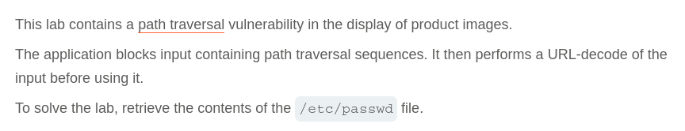
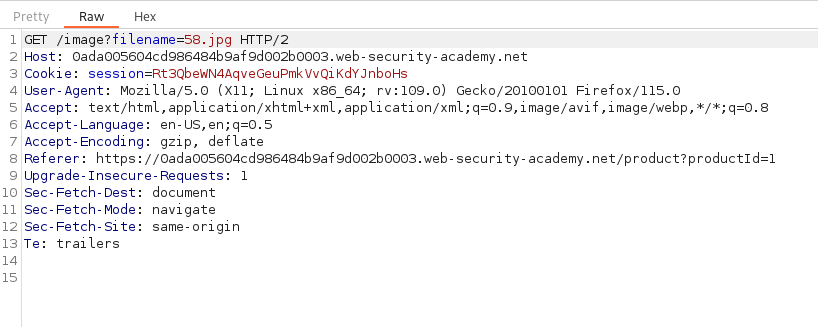
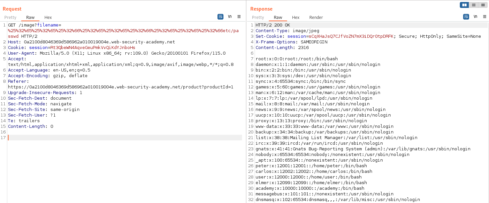

# Write-up: File path traversal, traversal sequences stripped with superfluous URL-decode

Lab-Link: <https://portswigger.net/web-security/file-path-traversal/lab-superfluous-url-decode>  
Difficulty: PRACTITIONER  
  

## Lab description

## Steps

As per the description, the vulnerability lies in the product image. On intercepting the product image request using burpsuite, we can see that the request url is `/image?filename=58.jpg` here the filename parameter is used for specifiying the filename and possibly the path also.

As per the lab description, the application is blocking the path traversal sequences and then perform URL-decode on the filename values. Using the payload from previous lab `/image?filename=....//....//....//etc/passwd` we get response with status 400 "No such file" which proves that the application is blocking the path traversal sequences recursively.

Now when we try a payload with double URL encoding instead of single URL encoding (because application is already doing decoding) where paylaod `%25%32%65%25%32%65%25%32%66%25%32%65%25%32%65%25%32%66%25%32%65%25%32%65%25%32%66etc/passwd` we get response with status 200 and the values of file `/etc/passwd` successfully.

Hence, we are able to fetch the file `/etc/passwd`

