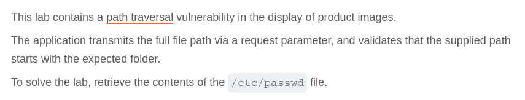
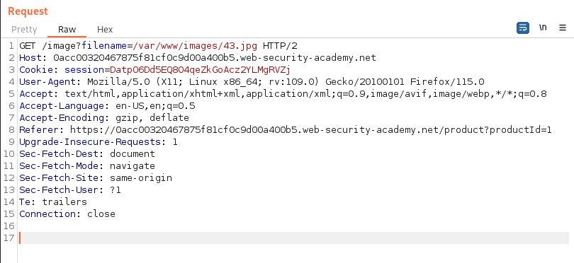
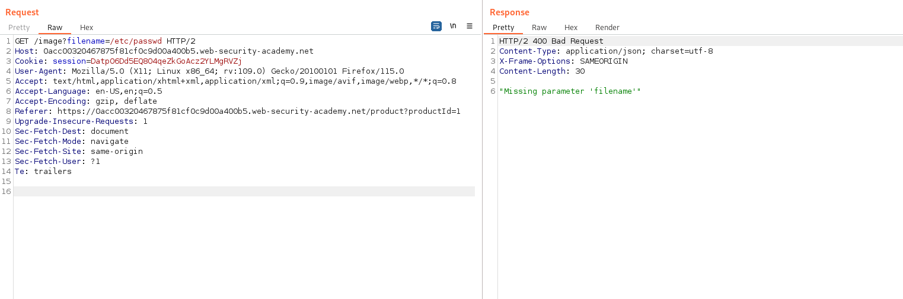
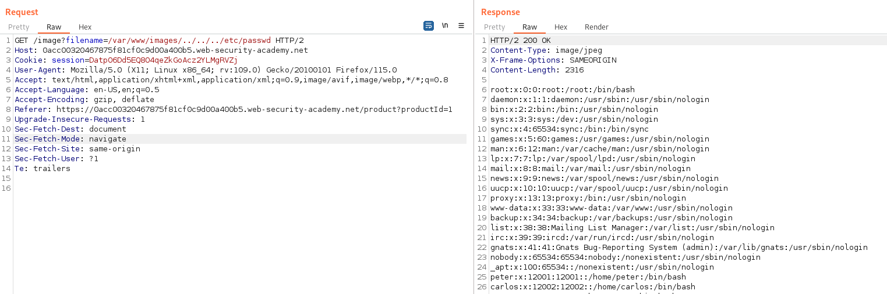

# Write-up: File path traversal, validation of start of path

Lab-Link: <https://portswigger.net/web-security/file-path-traversal/lab-validate-start-of-path>  
Difficulty: PRACTITIONER  
  

## Lab description

## Steps

As per the description, the vulnerability lies in the product image. On intercepting the product image request using burpsuite, we can see that the request url is `/image?filename=/var/www/images/43.jpg` here the filename parameter is used for specifiying the filename and possibly the path also.

The filename parameter is taking input with the complete path of the file, so we can manipulate it to get the `/etc/passwd`. When we use payload `/image?filename=/etc/passwd`, we get error "Missing parameter 'filename'" which means that the directory can only be `images`.

We can manipulate the path and use a path relative to the images directory, `/image?filename=/var/www/images/../../../etc/passwd`, this payload gives 200 status and content of the `/etc/passwd` file.

Hence, we are able to fetch the file `/etc/passwd`

