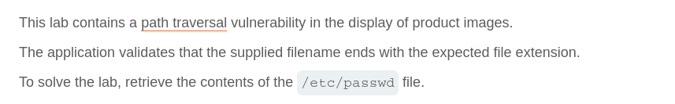
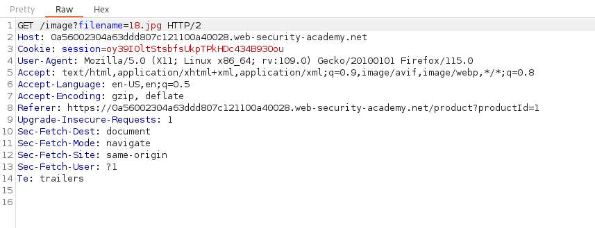
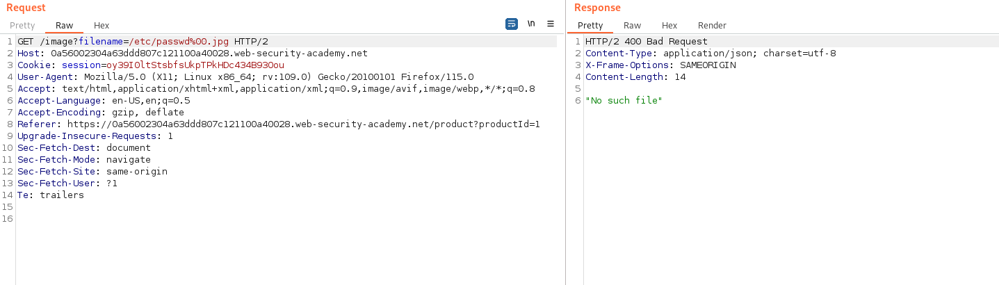
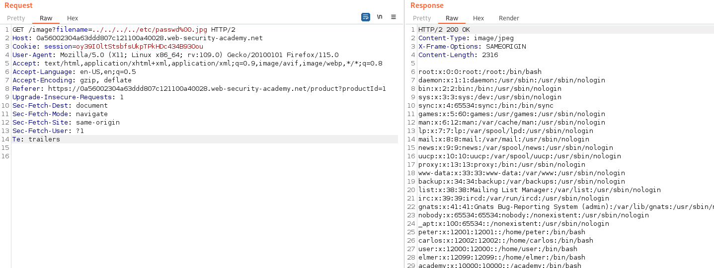

# Write-up: File path traversal, validation of file extension with null bytes bypass

Lab-Link: <https://portswigger.net/web-security/file-path-traversal/lab-validate-file-extension-null-byte-bypass>  
Difficulty: PRACTITIONER  
  

## Lab description

## Steps

As per the description, the vulnerability lies in the product image. On intercepting the product image request using burpsuite, we can see that the request url is `/image?filename=/var/www/images/43.jpg` here the filename parameter is used for specifiying the filename and possibly the path also.

As per the lab description, the application only allows files with particular extension and in this case it is `.jpg` because all product images have extension `.jpg`. In this case, we can null bytes `%00` which terminates the file path before the requried extension. So, if we use this payload `/image?filename=/etc/passwd%00.jpg` we get status 400 "No such file"

But if we use relative path instead of absolute path `/image?filename=../../../../etc/passwd%00.jpg` we get response with status 200 and content of file `/etc/passwd`

Hence, we are able to fetch the file `/etc/passwd`.

