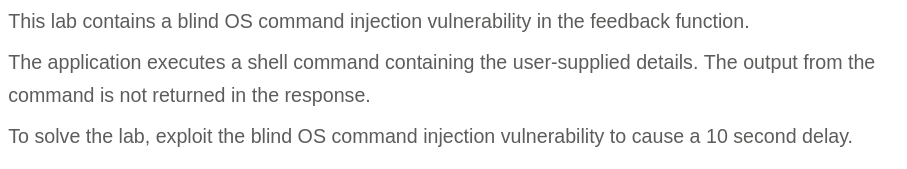
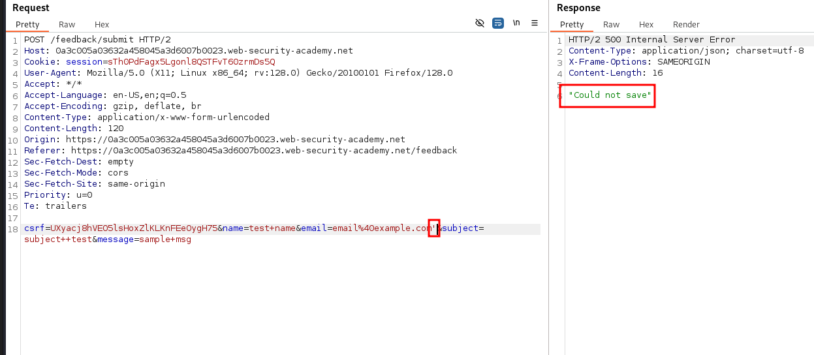
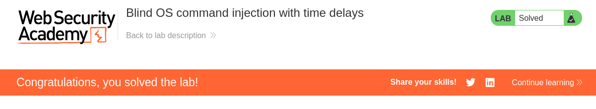

# Write-up: Exploiting an API endpoint using documentation

Lab-Link: <https://portswigger.net/web-security/api-testing/lab-exploiting-api-endpoint-using-documentation>  
Difficulty: APPRENTICE  
  

## Lab description

### Goals

- 

## Steps

 

